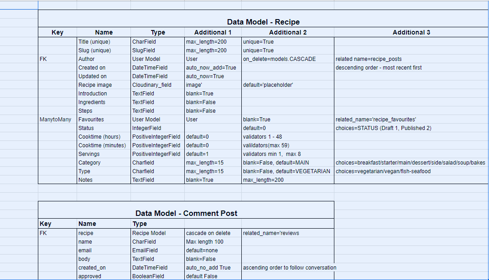
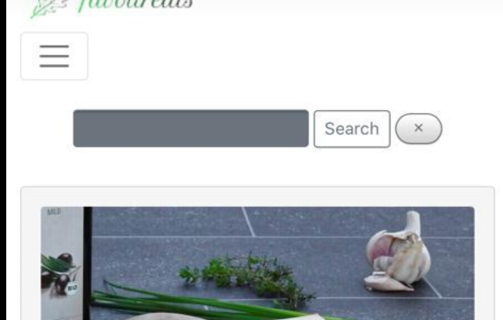
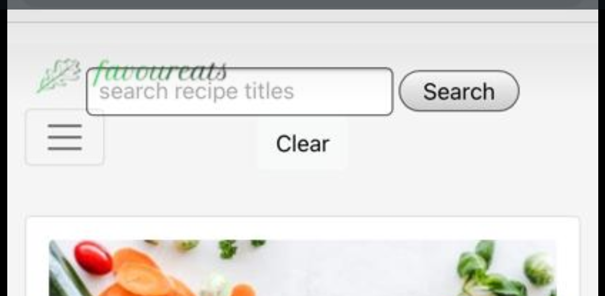
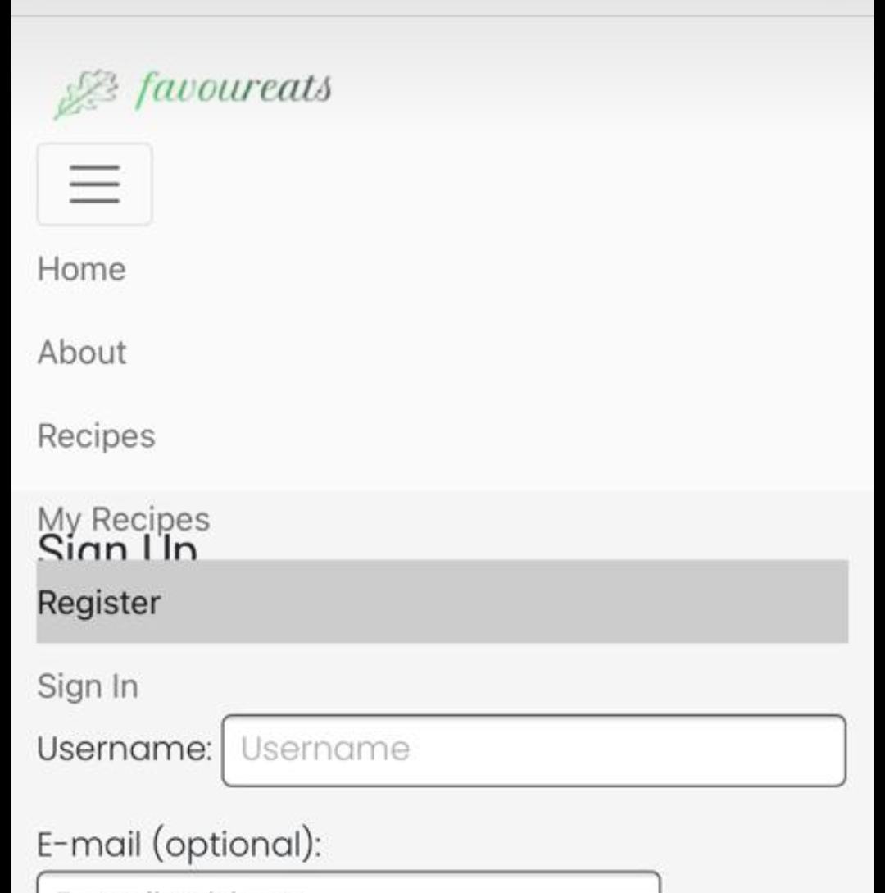

Favoureats - Tried and Tested Recipes


# UX
## Strategy
### Agile
The Agile methodology was used to plan the project. Github was used as the tool to demonstrate this. However Github is not the ideal tool to adequately link Iterations - Epics - User Stories. Although I linked User Stories (Issues) to Epics (Milestones) and placed these in Iterations (Milestones), Epics did not automatically show the % progress to completion once user stories were moved in the kanban board. It also proved difficult with this developer's level of competence and the short time frame allowed, to accurately itemise all tasks in a user story in advance of implementation. As a result some user stories were updated during the course of implementation.

### Project Goal

The goal of the project is to create a recipe website with tried and tested recipes for both family meals and dinner parties. Inspiration for the site came from my book club group who requested a place to store the recipes for the lovely dinners provided at their regular meetings. This idea was expanded to appeal more broadly to general users looking for good recipes and a means to store, edit and delete their own favourite recipes.

### Epics and User Stories
#### Epic: Set up admin page for admin to manage recipe posts, reviews and site users
#### User Stories:
  * As a site admin I can CRUD draft recipe posts so that I can complete the recipes later (must-have / complete)
  * As a Site Admin I can CRUD recipes so that I can manage my site content (must-have / complete)
  * As a site admin I can approve reviews so that I can filter out inappropriate content (must-have / complete)
  * As an admin I can view the number of likes on a recipe post so that I can know which are the most popular
  * As an admin I can view reviews of a recipe post so that I can read the commentary on a recipe
  * As an admin I can create reviews of recipe posts so that I can generate discussion on recipe posts

#### Epic: Enable users to register on the site to access full features
#### User Stories:
  * As a user I can register an account so that I can access the full range of features on the site (must-have / complete)
#### Epic: Enable users to login/logout on the site to access full features
#### User Stories:
  * As a registered user I can login and logout of the site so that I can access my content (must-have / complete)
#### Epic: Enable registered users to review recipe posts
#### User Stories:
  * As a registered user I can click on a post in the recipe list so that I open the full recipe post (must-have / complete)
#### Epic: Create landing page to attract users to the site
#### User Stories:
  * As a user I can view a snapshot of the site on the landing page so that know what the site's purpose is
#### Epic: Enable registered users to read full recipe posts and reviews
#### User Stories:
  * As a registered user I can click on a post in the recipe list so that I open the full recipe post
#### Epic: Enable registered users to CRUD their own recipes
#### User Stories:
  * As a registered user I can CRUD my own recipes so that I can manage my own content (should-have / complete)
#### Epic: Create recipe list page to showcase content to users
#### User Stories:
  * As a user I can view a list of recipes so that I can see what I would like to select if registered (must-have / complete)
#### Epic: Enable registered users to search through their own recipes to enhance UX
#### User Stories:
  * As a user I can search my own recipe posts by title so that easily find a recipe (should-have / complete)
  * As a user I can search recipes by ingredient so that I can easily find a recipe that I want to use (could-have / future features)
#### Epic: Enable registered users to interact with recipe posts to enhance UX
#### User Stories:
  * As a registered user I can favorite/unfavorite recipes so that I can interact with the site content (must-have / complete)
  * As a logged-in user I can review a recipe so that I can interact with the site (must-have / complete)
#### Epic: Enable users to filter recipe posts to enhance UX
#### User Stories:
  * As a user I can search recipes by ingredient so that I can easily find a recipe that I want to use (could-have / future feature)
  * As a registered user I can filter favourite recipes to a list so that I can find all my favourites easily (should-have / future feature)
#### Epic: Create recipe list page to showcase content to users
#### User Stories:
  * As a user I can view a paginated list of recipes so that I can easily move through the list of recipes (could-have / future feature)
#### Epic: Enable users to sign-in/register with Google/Facebook account
#### User Stories:
  * As a user I can register an account with social networks so that I can streamline my accounts (could-have / future feature)
#### Epic: Enable users to CRUD own reviews
#### User Stories:
  * As a registered user I can create/read/update/delete my own review posts so that I can manage my own content (should-have / complete)

## Scope
  * The scope of the project was large at the planning stage and during the course of implementation the scope was narrowed in order to meet the project's hard deadline. 

## Structure
### Existing Features
#### All Pages
????????? Screenshots here same as for user story testing?????
  * Navbar: with logo linking back to the home page, links to Home, About, Recipes, My Recipes, Register and Sign In/Out pages. The Home, About and Recipes page links are visible to and can be accessed by any user. If the user is not logged in the Register and Sign in links are visible in the navbar. If the user is signed in the Register and Sign In links are replaced by a Sign Out link.

  
  * Footer: links to Facebook, Instagram and Twitter
  * Social media icons
#### Home Page
  * Hero Image with overlay text highlighting the purpose of the site
  * Call to action register button on hero image to encourage users to register. Button becomes invisible if user is signed in
  * Snapshot images of three most recent recipe posts with title, date added and author. This page will update automatically as new recipes are added which keeps the site fresh and interesting to users.
  * Call to action button to 'View recipes' at bottom of page to direct users easily onto view the full recipe list page
#### About Page
  * Image with background information about the website
  * Call to action button to direct users to the recipes page
#### Recipes Page
  * Images and titles of all the recipes are visible on the page. Paginated????????
  * The recipe titles link to the full recipe detail page which can only be accessed by logged in users. Users who are not logged in are redirected to the sign-in page
  * Back to top button which remains on screen once user has started scrolling. When there are more recipes on the site this will improve the UX by making it easy for the user to return to the top and search for a recipe or navigate to a different page.

#### My Recipes Page
This page is only viewable by a logged in user
  * A call to action button is clearly visible to the user to 'Add a Recipe'. When a user clicks on this button the recipe form opens where the user can enter all the fields of the recipe.
  * List of recipes created by this logged in user organised in a table in reverse order of creation and by title. 
  Three link options are available for the user to view, edit and delete their own recipes
  * View link: user can click to view the full recipe detail page
  * Edit: user can click to edit the recipe details
  * Delete: the user can delete a recipe
#### Sign-In Form

#### Register

#### Sign-Out


#### Recipe Form page


### Admin Features

### Future Features
* User sign-in with Google/Facebooks
* Search/Filter on Recipes page
* Search/Filter by ingredient
* Filter by favourites
* Apply full CRUD functionality to user's own reviews

## Skeleton
### Wireframes

* [Home Page]
* [About Page]
* [Recipes Page]
* [My Recipes Page]
* [Recipe Detail Page]
* Sign in etc???????

### Data Models
There are two models for the database: A Recipe model and a Review model



The pdf of these models' tables can be seen [here](https://github.com/siobhanlgorman/favoureats/blob/main/documentation/data_models.pdf)
## Surface
## Design
My style is to keep everything minimalist and uncluttered, fresh and clean looking. 
### Colours
The colours are chosen to convey nature, fresh clean and nutritious like a clean kitchen and fresh natural food. Colours used are: white, green, grey, charcoal font? black?
### Typography
Fonts: Poppins for the text and Roboto for the headings
### Images
The hero image was chosen as the food is primarily vegetarian. The image is simple and elegant. Images were selected for the recipes which made the food look appetising.


# Technologies Used
## Languages
* HTML5 semantic markup
* CSS stylesheets
* JavaScript??????????
* Python
  * Python modules: crispy-forms, summernote, django=allauth, dj-database,

## Frameworks
* Django
* ?????? Postgres for the database
* ?????? SQLLite for the local environment

## Other Technologies
* Cloudinary was used to host the static files and media
* Gitpod as the IDE
* GitHub for version control
* Heroku was used as the cloud based platform for deployment
* Fontawesome
* Google Fonts
* Balsamiq
* Google Dev Tools
* Favicon.cc
* ??? Am I responsive
* Google Sheets - for the data models
* Icon
* Favicon
* Summernote


# Testing
## Browser compatibility
## Responsiveness
## Code Validation
## User Story Testing
## Manual Testing
## Automated Testing
  * test files in testing md?

## Bugs
### Resolved Bugs
1. Image uploads from front end to home page and recipes page but is not visible in recipe detail page. Solved by changing src from `recipe_image` to `recipe.recipe_image.url`
2. When I added success messages to the create, edit and delete recipe functions the delete message would not appear. To fix this I had to override the delete method in the DeleteView with a delete function. I found the solution in [here](https://stackoverflow.com/questions/47636968/django-messages-for-a-successfully-delete-add-or-edit-item)
3. User generated ingredients and steps do not appear as lists. Fixed by adding `|linebreaks` to the steps and ingredients sections of the recipe detail template

4. My recipe_confirm_delete template could not be found when located with the other messages templates and provoked an error on delete file could not be found. As the error message stated that it looked in file path: `recipe/templates`. In order to fix this error speedily I created the folder `recipe` and placed the recipe_confirm_delete.html template there to fix the error. Given more time I would investigate this further.
5. Number of comments does not appear on recipes page but number of favourites does: I troubleshooted with various print() statements to determine what was being read and fixed by renaming variable to `{{ recipe.reviews.count }}`

6. IPhone 11 search bar bug: Text does not enter into search box the first time but does the second time. The search function works but currently the UX is not good. I fixed this by change the form type, inputs and button until it worked on IPhone!

7. Safari rendering /Iphone 11/ IPhone SE: 
* search button x appears rounded on iPhone8. After the changes in bug fix 6 the button still appears a little different Fix changed to grn-btn style and removed border



* iphone 10R hamburger menu overlapping logo: Fixed by changing navbar layout and search bar as above






### Unresolved Bugs

## Deployment

## Heroku
#### Creating the inital Django app
* First follow these steps to create your app:
add to local deployment section: here
* Install Django and gunicorn: `pip3 install django gunicorn`
* Install supporting database libraries dj_database_url and psycopg2 library: `pip3 install dj_database_url psycopg2`
* Install Cloudinary libraries to manage photos: in the terminal window type `pip3 install dj-3-cloudinary-storage`
to here

* Create file for requirements: in the terminal window type `pip freeze --local > requirements.txt`
* Create project: in the terminal window type `django-admin startproject project_name .`
* Create app: in the terminal window type `python3 manage.py startapp app_name`
* Add app to list of `installed apps` in settings.py file: `'app_name'`
* Migrate changes: in the terminal window type `python3 manage.py migrate`
* Run the server to test if the app is installed: in the terminal window type `python3 manage.py runserver`
* If the app has been installed correctly the window will display `The install worked successfully! Congratulations!`


#### Create your Heroku app
* Navigate to the Heroku website
* In the Heroku browser window, create an account by entering your email address and a password
* Activate the account through the authentication email sent to your email account
* Click the new button and select create a new app from the dropdown menu
* Enter a name for the application which must be unique, in this case the app name is 'favoureats'
* Select a region, in this case Europe
* Click create app

3. Create the Database
* In the Heroku dashboard click on the Resources tab
* Scroll down to Add-Ons, search for and select 'Heroku Postgres'
* In the Settings tab, scroll down to 'Reveal Config Vars' and copy the text in the box beside DATABASE_URL.

4. Set up Environment Variables
* In Gitpod create a new env.py file in the top level directory
* Add env.py to the .gitignore file
* In env.py import the os library
* In env.py add `os.environ["DATABASE_URL"]` = "Paste in the text link copied above from Heroku DATABASE_URL" from step 3
Insert yours here
* In env.py add `os.environ["SECRET_KEY"] = "Make up your own random secret key"`
* In Heroku Settings tab Config Vars enter the same secret key created in env.py by entering 'SECRET_KEY' in the box for 'KEY' and your randomly created secret key in the 'value' box.

5. Connect the environment variables to Django

* In your Django 'settings.py' file type:

 ```
 from pathlib import Path
 import os
 import dj_database_url

 if os.path.isfile("env.py"):
  import env
 ```
* Remove the default insecure secret key in settings.py and replace with the link to the secret key variable i Heroku by typing: `SECRET_KEY = os.environ.get(SECRET_KEY)`
* Comment out the `DATABASES` section in settings.py and replace with:
```
DATABASES = {
  'default': 
  dj_database_url.parse(os.environ.get("DATABASE_URL"))
  }`
```
6. Make migrations
* In the terminal type:
```
python3 manage.py makemigrations`
python3 manage.py migrate`
```
7. Set up Cloudinary for static and media files storage
* Create a Cloudinary account and from the 'Dashboard' in Cloudinary copy your url into the env.py file by typing: `os.environ["CLOUDINARY_URL"] = "your link goes here but you must remove the start so it begins with 'cloudinary://"`
* In Heroku  add cloudinary url to 'config vars' add in Heroku: type CLOUDINARY_URL: your url here e.g. cloudinary:// fix here??????
* In Heroku condfig vars add DISABLE_COLLECTSTATIC with value of '1' (note: this must be removed for final deployment)
* Add Cloudinary libraries to installed apps section of `settings.py` in this order: 
 ```
 'cloudinary_storage'
 'django.contrib.staticfiles''
 'cloudinary'
 ```
* Connect Cloudinary to the Django app in `settings.py`:
```
STATIC_URL = '/static'
STATICFILES_STORAGE = 'cloudinary_storage.storage.StaticHashedCloudinaryStorage'
STATICFILES_DIRS = [os.path.join(BASE_DIR, 'STATIC')]
STATIC_ROOT = os.path.join(BASE_DIR, 'staticfiles')
MEDIA_URL = '/media/'
DEFAULT_FILE_STORAGE =
'cloudinary_storage.storage.MediaCloudinaryStorage'
* Link file to the templates directory in Heroku 
* Place under the BASE_DIR: TEMPLATES_DIR = os.path.join(BASE_DIR,
'templates')
```
* Change the templates directory to TEMPLATES_DIR. Place within the TEMPLATES array: `'DIRS': [TEMPLATES_DIR]`
* Add Heroku Hostname to ALLOWED_HOSTS: ```ALLOWED_HOSTS =
['favoureats.herokuapp.com', 'localhost']```

9. Create `media`, `static` and `templates` folders in top level directory
10. Create Procfile in top level directory: 
* In Procfile add: `web: gunicorn favoureats .wsgi`
11. In terminal add, commit, and push: 
```
git add <filename>
git commit -m “Deployment Commit”
git push
```
12. Heroku Deployment: 
* Click Deploy tab in Heroku
* In the 'Deployment method' section select 'Github' and click the 'connect to Github' button to confirm.
* In the 'search' box enter the Github repository name for the project: favoureats: https://github.com/siobhanlgorman/favoureats

* Click search and then click connect to link the heroku app with the Github repository. The box will confirm that heroku is connected to the repository.

13. Final Deployment
In the IDE: 
* When development is complete in `settings.py` change the debug setting to: `DEBUG = False`
* In settings.py add: `X_FRAME_OPTIONS = 'SAMEORIGIN'` which enables the summernote editor to work in Heroku.
* In Heroku settings config vars change the DISABLE_COLLECTSTATIC value to 0
* Because DEBUG must be switched to True for development and False for production it is recommended that only manual deployment is used in Heroku. 
* To manually deploy click the button 'Deploy Branch'. The default 'main' option in the dropdown menu should be selected in both cases. When the app is deployed a message 'Your app was successfully deployed' will be shown. Click 'view' to see the deployed app in the browser. The live deployment of the project can be seen [here](https://favoureats.herokuapp.com)

## Local Deployment: Forking and Cloning
### Forking the Repository

??????
* For this project to run locally an env.py file must be set up by the user containing the following sensitive information:
"DATABASE_URL" the postgres database address from Heroku
"SECRET_KEY"
"CLOUDINARY_URL"

To create an env.py file??????????????:

* All the necessary requirements must be added by creating a requirements.txt file
`pip install -r requirements.txt`

* Procfile

If you wish to fork the repository to make changes without affecting the original you can fork it by navigating to the favoureats repository [at](https://github.com/siobhanlgorman/favoureats). 
* Above the list of files click the dropdown code menu.
* Select the https option and copy the link.
* Open the terminal.
* Change the current working directory to the desired destination location.
* Type the git clone command with the copied URL: `git clone https://github.com/siobhanlgorman/favoureats.git`.
* Click the 'Fork' button at the top right of the page. A forked copy of the repository will appear in your Repositories page.
### Cloning the Repository
* On Github navigate to the main page of Favoureats [at](https://github.com/siobhanlgorman/favoureats).
* Above the list of files click the dropdown code menu.
* Select the https option and copy the link.
* Open the terminal.
* Change the current working directory to the desired destination location.
* Type the git clone command with the copied URL: `git clone https://github.com/siobhanlgorman/favoureats.git`.
* Press enter to create the local clone.


# Credits

* [Dennis Ivy 'Django To Do List App With User Registration & Login'](https://www.youtube.com/watch?v=llbtoQTt4qw&t=68s) was useful for full CRUD functionality application.

* This tutorial was used to auto generate slugs from the front-end: [Kodnito](https://kodnito.com/posts/slugify-urls-django/)

* The following tutorials were useful for automated testing:
  * [Django Testing](https://www.youtube.com/watch?v=GBgRMdjAx_c)
  * [Automated Tests - Day 6 - Django Bootcamp](https://www.youtube.com/watch?v=5E_xLmQXOZg)
  * This series: [Django Testing Tutorial - What Is Testing? #1](https://www.youtube.com/watch?v=qwypH3YvMKc)


* [Stack Overflow](https://stackoverflow.com/) was used for general queries

## Images
Dinner Party Image by <a href="https://pixabay.com/users/pexels-2286921/?utm_source=link-attribution&amp;utm_medium=referral&amp;utm_campaign=image&amp;utm_content=1852926">Pexels</a> from <a href="https://pixabay.com/?utm_source=link-attribution&amp;utm_medium=referral&amp;utm_campaign=image&amp;utm_content=1852926">Pixabay</a>