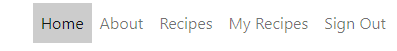

# Favoureats - Tried and Tested Recipes
## UX
### Strategy
#### Agile
The Agile methodology was used to plan the project. Github was used as the tool to demonstrate this.
1. Projects were used to divide the project into three iterations with a simple Kanban board.
2. Milestones were used to create Epics with a custom template
3. Issues were used to create User Stories with a custom template. Eash user story is clearly described with a title, statement, acceptance criteria and tasks

Each user story was linked to an Epic and placed within one of three Iterations. The user stories were labelled 'must do' 'could do' and 'should do' in order to prioritise the work. As work on a user story was begun the story was moved from the 'to do' column of the board to the 'In progress' column. When work on the story was complete the user story was moved into the 'done' column.

However Github is not the ideal tool to adequately link Iterations - Epics - User Stories. Although I linked User Stories (Issues) to Epics (Milestones) and placed these in Iterations (Milestones), Epics did not automatically show the % progress to completion once user stories were moved in the kanban board. It was also difficult given the tight time frame and developer's level of knowledge to accurately plan out the content of each user story in advance. As a result some user stories were updated during the course of implementation. 

#### Project Goal
The goal of the project is to create a recipe website with tried and tested recipes for both family meals and dinner parties. Inspiration for the site came from the developer's book club group who requested a place to store the recipes for the lovely dinners provided at their regular meetings. The developer's family also wanted a means to access family favourite recipes so the project was expanded to appeal more broadly to general users looking for good recipes and a means to store, edit and delete their own favourite recipes.
The target user is someone:
* who wants to find recipes to use to cook for the family or friends
* who wants to store their own favourite recipes in one place
* who wants to share their favourite recipes

#### Epics and User Stories
There are 11 Epics and 20 User Stories. The User Stories are numbered so can be easily tracked. However during the planning stage as the stories were being amended their id numbers(#) are no longer in sequence.
1. Epic: Set up admin page for admin to manage recipe posts, reviews and site users
* User Stories:
  * As a site admin I can CRUD draft recipe posts so that I can complete the recipes later (must-have / complete)(#8)
  * As a site admin I can CRUD recipes so that I can manage my site content (must-have / complete)(#9)
  * As a site admin I can approve reviews so that I can filter out inappropriate content (must-have / complete)(#10)
  * As a site admin I can view the number of favourites on a recipe post so that I can know which are the most popular(#28)
  * As a site admin I can view reviews of a recipe post so that I can read the commentary on a recipe(#29)
  * As a site admin I can create reviews of recipe posts so that I can generate discussion on recipe posts(#31)

2. Epic: Enable users to register on the site to access full features
* User Stories:
  * As a user I can register an account so that I can access the full range of features on the site (must-have / complete)(#18)
  * As a registered user I can login and logout of the site so that I can access my content (must-have / complete)(#19)
3. Epic: Create landing page to attract users to the site
* User Stories:
  * As a user I can view a snapshot of the site on the landing page so that know what the site's purpose is (must-have/complete)(#24)
4. Epic: Enable registered users to CRUD their own recipes
* User Stories:
  * As a registered user I can CRUD my own recipes so that I can manage my own content (should-have / complete)(#12)
5. Epic: Create recipe list page to showcase content to users
* User Stories:
  * As a user I can view a list of recipes so that I can see what I would like to select if registered (must-have / complete)(#15)
6. Epic: Enable registered users to search through the recipes to enhance UX
* User Stories:
  * As a user I can search my own recipe posts by title and ingredient so that easily find a recipe (should-have / complete)(#23)
  * As a user I can search through the recipe list page by title and ingredient so that I can easily find a recipe (should-have / complete) (25)
7. Epic: Enable registered users to interact with recipe posts to enhance UX
* User Stories:
  * As a registered user I can click on a post in the recipe list so that I open the full recipe post (must-have / complete)(#20)
  * As a registered user I can favorite/unfavorite recipes so that I can interact with the site content (must-have / complete)(#11)
  * As a logged-in user I can review a recipe so that I can interact with the site (must-have / complete)(#32)
8. Epic: Enable users to filter recipe posts to enhance UX
* User Stories:
  * As a user I can filter all recipes by ingredient/favourite so that I can easily sort the recipes (could-have / future feature)(#22)
9. Epic: Create recipe list page to showcase content to users
* User Stories:
  * As a user I can view a paginated list of recipes so that I can easily move through the list of recipes (could-have / future feature)(#33)
10. Epic: Enable users to sign-in/register with Google/Facebook account
* User Stories:
  * As a user I can register an account with social networks so that I can streamline my accounts (could-have / future feature)(#30)
11. Epic: Enable users to CRUD own reviews
* User Stories:
  * As a registered user I can create/read/update/delete my own review posts so that I can manage my own content (could-have / complete)(#17)

### Scope
  * The scope of the project was large at the planning stage. While the ultimate goal was to allow logged in users to have full CRUD functionality for all their own content, time constraints meant this was limited to CRUD functionality only for their own recipes as this was deemed a must-have. More functionality for logged in users will be added in the future. In addition further front-end admin functionality will be added in the future but for this project full management is limited to backend Django admin panel and front-end CRUD over the recipes created by the admin.

### Structure
The website consists of six pages: Home, About, Recipes, My Recipes, Register and Sign In/Sign Out pages. Home, About and Recipes can be viewed by all users. My Recipes is limited to logged in users. 

### Existing Features
#### All Pages

* Navbar: 
  - logo linking back to the home page:

  

  - Links to Home, About, Recipes, My Recipes, Register and Sign In/Out pages: 
  The Home, About and Recipes page links are visible to and can be accessed by any user. If the user is not signed in the Sign in and Register links are visible in the navbar. If the user is signed in the Sign In and REgister links are replaced by a Sign Out link and the My Recipes page link is visible.




- The active page is highlighted for good UX:


- The navbar sticks to the top of the page so remains in view for the user to easily navigate around the site


- The navbar collapses for mobile and portrait tablets:


* Footer: with clearly visible links to direct the user to the Facebook, Instagram and Twitter pages


  
#### Home Page
* Hero Image with overlay text highlighting the purpose of the site


* Call to action register button on hero image is visible to users who are not logged in to encourage registration to access the features highlighted on this page. The button becomes invisible if the user is signed in. 


* Text with links directing users to the features available to logged in users


* Snapshot images of three most recent recipe posts with title, date added and author. This page updates automatically as new recipes are added which keeps the site fresh and interesting to users.


* Call to action button to 'View the Recipes' at bottom of page to direct users easily onto view the full recipe list page


#### About Page
* Image with background text information about the website


* Call to action button 'View the Recipes' to direct users onwards to the main recipes page


#### Recipes Page
  * Images with summary description of all the recipes are visible on the page. Recipe title is a link to the full recipe detail page for logged in users. Stars representing favourites and comment icons representing reviews have total number beside them:


  * A search bar above the list of recipes to enable users to easily locate a particular recipe by a keywork from the title or ingredients fields. Clickable icons to search and an 'x' to clear search back to full list of recipes:


  * The recipe titles link to the full recipe detail page which can only be accessed by logged in users. Users who are not logged in are redirected to the sign-in page:


  * A back to top arrow on bottom right which remains on screen once user has started scrolling to impove UX by making it easy for the user to return to the top of the page to search or navigate to a different page:


  * A call to action 'Add a Recipe' button which will direct logged in users to my recipes page and non-logged in users to the sign in page. This allows users to intuitive navigate their journey on the website:


#### My Recipes Page
This page can only be accessed by a logged in user. The navigation link only appears when a user is logged in. The page displays a table list of recipes which have been added by the logged in user.

  * A search bar above the list of recipes to enable users to easily locate a particular recipe by a keywork from the title or ingredients fields. Clickable icons to search and an 'x' to clear search back to full list of recipes:


  * A call to action button is clearly visible to the user to 'Add a Recipe'. When a user clicks on this button the recipe form opens where the user can enter all the fields of the recipe:


  * The list of recipes created by the logged in user is organised in a table in reverse order of creation and by title with three link options available for the user to view, edit and delete their own recipes:


     - View: user can click to open the full recipe detail page
     - Edit: user can click to open the completed recipe form and edit the details to resubmit with changes


     - Delete: the user can delete a recipe. A warning is displayed to allow for change of mind before deletion and a button with option to return to My Recipes page:


#### Recipe Detail Page

Accessed only by logged in users
* The star icon which can be clicked to favourite/unfavourite a recipe features prominently:
* The number of favourite stars given to the recipe is underneath the star and updates when the user clicks the star
* Messages are displayed to confirm user's actions:


* the about section of the recipe includes the 'updated on' field which will display the date of any changes made to the recipe details:


* the bottom of the page displays a form to submit a recipe review. After submission a success message displays and in the review box a note 'Your review is pending approval' is shown until the admin approves the review for publication:


#### Sign-In Form
* User signs in by entering username and password


* Choice of two action buttons: Sign In or Home which redirects to the home page


#### Register

* Users can register for an account by entering a username, an optional email and a password


* Choice of two action buttons: Sign Up or Home which redirects to the home page


#### Sign-Out

* Sign Out button which redirects to home page after signing out


#### Recipe Form page
* A form to submit with fields to complete to add a recipe to the public recipes page and to the user's list in the My Recipes page for CRUD functionality
* Users can add text, paste text into fields. Images can be uploaded and a placeholder image is available if no image is supplied.


* A Go Back button at the top to redirect users to the My Recipes page


* A Submit Recipe button at the bottom to submit the completed form


### Future Features
* Improvement could be made to the search feature. During implementation with a clear function inside the search box it was found that this only cleared the search but left the search findings list. It was decided that better UX would be to clear back to the full list so the form was changed and an 'x' was added outside the box to reload the page. Given further time I would look for a neater solution.
* The search function on the Recipes and My Recipes pages could be further refined to include filtering by category and organising the list in various orders e.g. alphabetised
* A useful future feature would be to filter by the user's favourites
* User sign-in with Google/Facebooks
* Apply full CRUD functionality to user's own reviews
* Currently images can be uploaded to the recipe form from the user's own computer or via a url. This could be further restricted by size and type to ensure consistency.
* In future it would be a good idea change the default setting to draft for users recipes to require approval before publication so the admin can check the content is suitable and consistent with the site ethos and style. 

### Skeleton
### Wireframes

* [Home Page]
* [About Page]
* [Recipes Page]
* [My Recipes Page]
* [Recipe Detail Page]
* Sign in etc???????

### Data Models
There are two models for the database: A Recipe model and a Review model


The pdf of these models' tables can be seen [here](https://github.com/siobhanlgorman/favoureats/blob/main/documentation/data_models.pdf)
### Surface
## Design
My style is to keep everything minimalist and uncluttered, fresh and clean looking. 
### Colours
The colours are chosen to convey nature, fresh clean and nutritious like a clean kitchen and fresh natural food. Colours used are: white, green, grey, charcoal font? black?
### Typography
Fonts: Poppins for the text and Roboto for the headings
### Images
The hero image was chosen as the food is primarily vegetarian. The image is simple and elegant. Images were selected for the recipes which made the food look appetising.


# Technologies Used
## Languages
* HTML5 semantic markup
* CSS stylesheets
* JavaScript??????????
* Python
  * Python modules: crispy-forms, summernote, django=allauth, dj-database,

## Frameworks
* Django
* ?????? Postgres for the database
* ?????? SQLLite for the local environment

## Other Technologies
* Cloudinary was used to host the static files and media
* Gitpod as the IDE
* GitHub for version control
* Heroku was used as the cloud based platform for deployment
* Fontawesome
* Google Fonts
* Balsamiq
* Google Dev Tools
* Favicon.cc
* ??? Am I responsive
* Google Sheets - for the data models
* Icon
* Favicon
* Summernote


# Testing
## Browser compatibility
## Responsiveness
## Code Validation
## User Story Testing
## Manual Testing
## Automated Testing
  * test files in testing md?

## Bugs
### Resolved Bugs
1. Image uploads from front end to home page and recipes page but is not visible in recipe detail page. Solved by changing src from `recipe_image` to `recipe.recipe_image.url`
2. When I added success messages to the create, edit and delete recipe functions the delete message would not appear. To fix this I had to override the delete method in the DeleteView with a delete function. I found the solution in [here](https://stackoverflow.com/questions/47636968/django-messages-for-a-successfully-delete-add-or-edit-item)
3. User generated ingredients and steps do not appear as lists. Fixed by adding `|linebreaks` to the steps and ingredients sections of the recipe detail template

4. My recipe_confirm_delete template could not be found when located with the other messages templates and provoked an error on delete file could not be found. As the error message stated that it looked in file path: `recipe/templates`. In order to fix this error speedily I created the folder `recipe` and placed the recipe_confirm_delete.html template there to fix the error. Given more time I would investigate this further.
5. Number of comments does not appear on recipes page but number of favourites does: I troubleshooted with various print() statements to determine what was being read and fixed by renaming variable to `{{ recipe.reviews.count }}`

6. IPhone 11 search bar bug: Text does not enter into search box the first time but does the second time. The search function works but currently the UX is not good. I fixed this by change the form type, inputs and button until it worked on IPhone!

7. Safari rendering /Iphone 11/ IPhone SE: 
* search button x appears rounded on iPhone8. After the changes in bug fix 6 the button still appears a little different Fix changed to grn-btn style and removed border


* iphone 10R hamburger menu overlapping logo: Fixed by changing navbar layout and search bar as above


### Unresolved Bugs
confirm delete custom template location????

## Deployment

## Heroku
#### Creating the inital Django app
* First follow these steps to create your app:
add to local deployment section: here
* Install Django and gunicorn: `pip3 install django gunicorn`
* Install supporting database libraries dj_database_url and psycopg2 library: `pip3 install dj_database_url psycopg2`
* Install Cloudinary libraries to manage photos: in the terminal window type `pip3 install dj-3-cloudinary-storage`
* Create file for requirements: in the terminal window type `pip freeze --local > requirements.txt`
* Create project: in the terminal window type `django-admin startproject project_name .`
* Create app: in the terminal window type `python3 manage.py startapp app_name`
* Add app to list of `installed apps` in settings.py file: `'app_name'`
* Migrate changes: in the terminal window type `python3 manage.py migrate`
* Run the server to test if the app is installed: in the terminal window type `python3 manage.py runserver`
* If the app has been installed correctly the window will display `The install worked successfully! Congratulations!`

#### Create your Heroku app
* Navigate to the Heroku website
* In the Heroku browser window, create an account by entering your email address and a password
* Activate the account through the authentication email sent to your email account
* Click the new button and select create a new app from the dropdown menu
* Enter a name for the application which must be unique, in this case the app name is 'favoureats'
* Select a region, in this case Europe
* Click create app

3. Create the Database
* In the Heroku dashboard click on the Resources tab
* Scroll down to Add-Ons, search for and select 'Heroku Postgres'
* In the Settings tab, scroll down to 'Reveal Config Vars' and copy the text in the box beside DATABASE_URL.

4. Set up Environment Variables
* In Gitpod create a new env.py file in the top level directory
* Add env.py to the .gitignore file
* In env.py import the os library
* In env.py add `os.environ["DATABASE_URL"]` = "Paste in the text link copied above from Heroku DATABASE_URL" from step 3
Insert yours here
* In env.py add `os.environ["SECRET_KEY"] = "Make up your own random secret key"`
* In Heroku Settings tab Config Vars enter the same secret key created in env.py by entering 'SECRET_KEY' in the box for 'KEY' and your randomly created secret key in the 'value' box.

5. Connect the environment variables to Django

* In your Django 'settings.py' file type:

 ```
 from pathlib import Path
 import os
 import dj_database_url

 if os.path.isfile("env.py"):
  import env
 ```
* Remove the default insecure secret key in settings.py and replace with the link to the secret key variable i Heroku by typing: `SECRET_KEY = os.environ.get(SECRET_KEY)`
* Comment out the `DATABASES` section in settings.py and replace with:
```
DATABASES = {
  'default': 
  dj_database_url.parse(os.environ.get("DATABASE_URL"))
  }`
```
6. Make migrations
* In the terminal type:
```
python3 manage.py makemigrations`
python3 manage.py migrate`
```
7. Set up Cloudinary for static and media files storage
* Create a Cloudinary account and from the 'Dashboard' in Cloudinary copy your url into the env.py file by typing: `os.environ["CLOUDINARY_URL"] = "cloudinary://<insert-your-url>"`
* In Heroku  add cloudinary url to 'config vars' add in Heroku: type CLOUDINARY_URL: your url here e.g. cloudinary:// fix here??????
* In Heroku condfig vars add DISABLE_COLLECTSTATIC with value of '1' (note: this must be removed for final deployment)
* Add Cloudinary libraries to installed apps section of `settings.py` in this order: 
 ```
 'cloudinary_storage'
 'django.contrib.staticfiles''
 'cloudinary'
 ```
* Connect Cloudinary to the Django app in `settings.py`:
```
STATIC_URL = '/static'
STATICFILES_STORAGE = 'cloudinary_storage.storage.StaticHashedCloudinaryStorage'
STATICFILES_DIRS = [os.path.join(BASE_DIR, 'STATIC')]
STATIC_ROOT = os.path.join(BASE_DIR, 'staticfiles')
MEDIA_URL = '/media/'
DEFAULT_FILE_STORAGE =
'cloudinary_storage.storage.MediaCloudinaryStorage'
* Link file to the templates directory in Heroku 
* Place under the BASE_DIR: TEMPLATES_DIR = os.path.join(BASE_DIR,
'templates')
```
* Change the templates directory to TEMPLATES_DIR. Place within the TEMPLATES array: `'DIRS': [TEMPLATES_DIR]`
* Add Heroku Hostname to ALLOWED_HOSTS: ```ALLOWED_HOSTS =
['favoureats.herokuapp.com', 'localhost']```

9. Create `media`, `static` and `templates` folders in top level directory
10. Create Procfile in top level directory: 
* In Procfile add: `web: gunicorn favoureats .wsgi`
11. In terminal add, commit, and push: 
```
git add <filename>
git commit -m “Deployment Commit”
git push
```
12. Heroku Deployment: 
* Click Deploy tab in Heroku
* In the 'Deployment method' section select 'Github' and click the 'connect to Github' button to confirm.
* In the 'search' box enter the Github repository name for the project: favoureats: https://github.com/siobhanlgorman/favoureats

* Click search and then click connect to link the heroku app with the Github repository. The box will confirm that heroku is connected to the repository.

13. Final Deployment
In the IDE: 
* When development is complete in `settings.py` change the debug setting to: `DEBUG = False`
* In settings.py add: `X_FRAME_OPTIONS = 'SAMEORIGIN'` which enables the summernote editor to work in Heroku.
* In Heroku settings config vars change the DISABLE_COLLECTSTATIC value to 0
* Because DEBUG must be switched to True for development and False for production it is recommended that only manual deployment is used in Heroku. 
* To manually deploy click the button 'Deploy Branch'. The default 'main' option in the dropdown menu should be selected in both cases. When the app is deployed a message 'Your app was successfully deployed' will be shown. Click 'view' to see the deployed app in the browser. The live deployment of the project can be seen [here](https://favoureats.herokuapp.com)

## Local Deployment: Forking and Cloning
### Forking the Repository

??????
* For this project to run locally an env.py file must be set up by the user containing the following sensitive information:
"DATABASE_URL" the postgres database address from Heroku
"SECRET_KEY"
"CLOUDINARY_URL"

To create an env.py file??????????????:

* All the necessary requirements must be added by creating a requirements.txt file
`pip install -r requirements.txt`

* Procfile

If you wish to fork the repository to make changes without affecting the original you can fork it by navigating to the favoureats repository [at](https://github.com/siobhanlgorman/favoureats). 
* Above the list of files click the dropdown code menu.
* Select the https option and copy the link.
* Open the terminal.
* Change the current working directory to the desired destination location.
* Type the git clone command with the copied URL: `git clone https://github.com/siobhanlgorman/favoureats.git`.
* Click the 'Fork' button at the top right of the page. A forked copy of the repository will appear in your Repositories page.
### Cloning the Repository
* On Github navigate to the main page of Favoureats [at](https://github.com/siobhanlgorman/favoureats).
* Above the list of files click the dropdown code menu.
* Select the https option and copy the link.
* Open the terminal.
* Change the current working directory to the desired destination location.
* Type the git clone command with the copied URL: `git clone https://github.com/siobhanlgorman/favoureats.git`.
* Press enter to create the local clone.


# Credits

* [Dennis Ivy 'Django To Do List App With User Registration & Login'](https://www.youtube.com/watch?v=llbtoQTt4qw&t=68s) was useful for full CRUD functionality application.

* This tutorial was used to auto generate slugs from the front-end: [Kodnito](https://kodnito.com/posts/slugify-urls-django/)

* The following tutorials were useful for automated testing:
  * [Django Testing](https://www.youtube.com/watch?v=GBgRMdjAx_c)
  * [Automated Tests - Day 6 - Django Bootcamp](https://www.youtube.com/watch?v=5E_xLmQXOZg)
  * This series: [Django Testing Tutorial - What Is Testing? #1](https://www.youtube.com/watch?v=qwypH3YvMKc)


* [Stack Overflow](https://stackoverflow.com/) was used for general queries

## Images
Dinner Party Image by <a href="https://pixabay.com/users/pexels-2286921/?utm_source=link-attribution&amp;utm_medium=referral&amp;utm_campaign=image&amp;utm_content=1852926">Pexels</a> from <a href="https://pixabay.com/?utm_source=link-attribution&amp;utm_medium=referral&amp;utm_campaign=image&amp;utm_content=1852926">Pixabay</a>

[Lasagne by Daniele Sgura from Pexels](https://www.pexels.com/photo/close-up-photo-of-lasagna-on-ceramic-plate-4162496/)

[Cookbook Image by <a href="https://pixabay.com/users/bru-no-1161770/?utm_source=link-attribution&amp;utm_medium=referral&amp;utm_campaign=image&amp;utm_content=1375788">Bruno /Germany</a> from <a href="https://pixabay.com/?utm_source=link-attribution&amp;utm_medium=referral&amp;utm_campaign=image&amp;utm_content=1375788">Pixabay</a>](https://pixabay.com/photos/cook-cookbook-side-enjoyment-meal-1375788/)

[Tofu Photo by Ella Olsson from Pexels](https://www.pexels.com/photo/vegetable-salad-3026808/)

## Recipes
[Lasagne](https://www.theguardian.com/food/2020/feb/24/thomasina-miers-recipe-for-cheats-lasagne-with-ricotta-and-greens)