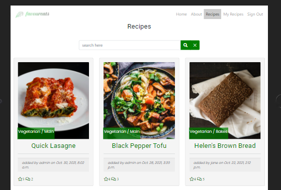
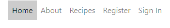
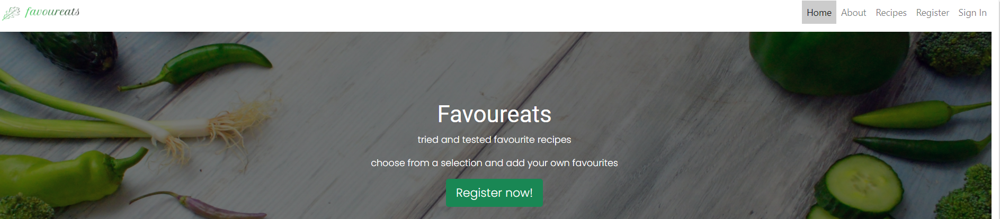
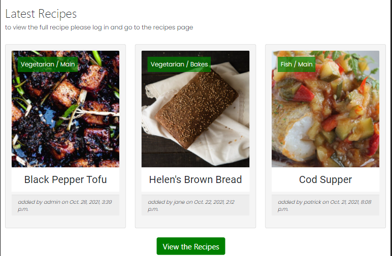
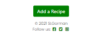
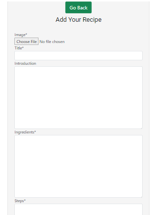
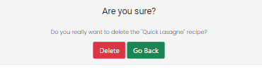
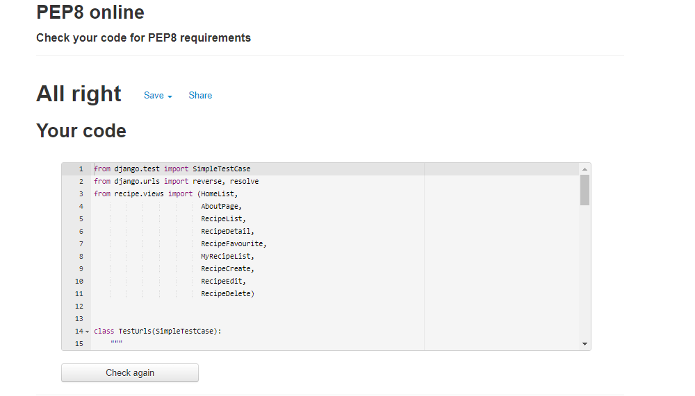
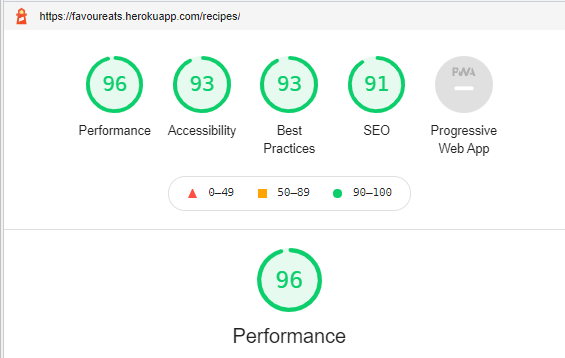

## Automated Testing
### Set-up for testing in local environment
After setting up the project according to the method recommended in course materials, there were errors in connecting to Postgres database for testing. In order to use the SQlite database instead the following code was added:
In settings.py:
```
if development:
     DATABASES = {
         'default': {
             'ENGINE': 'django.db.backends.sqlite3',
             'NAME': BASE_DIR / 'db.sqlite3',
         }
     }
 else:
     DATABASES = {
         'default': dj_database_url.parse(os.environ.get('DATABASE_URL'))
     }

 development = os.environ.get('DEVELOPMENT', False)

 if development:
     ALLOWED_HOSTS = ['localhost']
 else:
     ALLOWED_HOSTS = ['blog.herokuapp.com']
```
In env.py (to toggle between the databases False for Postgres, True for Sqlite):
```
os.environ["DEVELOPMENT"] = "True"
```
Then run the migrations to update the database
```
python3 manage.py makemigrations
python3 manage.py migrate
```

### Unittest

Unittest was used for the automated testing. Urls, Models and Views were tested. 85% coverage was achieved.
The coverage report: 


## Manual Testing

Thorough testing was conducted by the developer and multiple users among friends and family. Steps and results are as follows.

### Testing User Stories
#### Epic: Set up admin page for admin to manage recipe posts, reviews and site users
To test the admin user stories begin with the following steps:
1. Navigate to the website of [favoureats](https://favoureats.herokuapp.com/)
2. Click on the 'Sign In' tab on the navigation menu bar
3. Sign in with admin's name and password
4. Navigate to [admin page](https://favoureats.herokuapp.com/admin/)

#### *User Story*:
* As a site admin I can create draft recipe posts so that I can complete the recipes later (must-have / complete)[#8](https://github.com/siobhanlgorman/favoureats/issues/8)

Description: The site administrator is able to create draft recipes.

**Testing Steps**:
  
1. In the admin panel menu beside recipes click the add button
2. In the recipe form enter content in the fields
3. Click save to save the created recipe


**Expected Result**: A draft recipe is saved by default to the list of recipes in the admin panel

**Actual Result**: A draft recipe is saved to the list of recipes in the admin panel


**Pass/Fail: Pass**

#### *User Story*:
* As a Site Admin I can CRUD recipes so that I can manage my site content (must-have / complete)[#9](https://github.com/siobhanlgorman/favoureats/issues/9)

Description: The site administrator is able to create, read, update and delete recipes.

**Testing Steps**:
* To create a recipe:
  
1. In the admin panel menu beside recipes click the add button


*admin add recipe page*

2. In the recipe form enter content in the fields
3. Change the status to published from the status dropdown menu
4. Click save to save the created recipe

**Expected Result**: The recipe is saved as 'published' to the list of recipes in the admin panel. The recipe is viewable on the website

**Actual Result**: The recipe is saved as 'published' to the list of recipes in the admin panel. The recipe is viewable on the website
**Pass/Fail: Pass**

* To read/update a recipe:

1. In the admin panel list select a recipe title to read the full recipe
2. To update the recipe update the necessary fields and click save

**Expected Result**: The viewed/updated recipe is saved to the list of recipes

**Actual Result**: The viewed/updated recipe is saved to the list of recipes
**Pass/Fail: Pass**

* To delete a recipe:
1. From the list of recipes in the admin panel select the recipe to be deleted in the checkbox beside the title
2. In the action dropdown menu above the list select 'delete' and 'go' to delete the recipe

**Expected Result**: The viewed/updated recipe is deleted from the list of recipes and is not visible on the website

**Actual Result**: The viewed/updated recipe is deleted from the list of recipes and is not visible on the website

**Pass/Fail: Pass**
  

*draft recipe created*

#### *User Story*:
* As a site admin I can approve reviews so that I can filter out inappropriate content (must-have / complete)[#10](https://github.com/siobhanlgorman/favoureats/issues/10)

**Testing Steps**:

1. In the admin panel select reviews to view a list of draft and published reviews
2. In the list select a review in the checkbox
3. In the action dropdown menu above the list select 'approve selected review' or 'delete selected review' and then 'go'

**Expected Results**

1. The approved review is published on the website
2. The deleted review is removed from the list of reviews

**Actual Results**

1.  The approved review is published on the website
2. The deleted review is removed from the list of reviews
**Pass/Fail: Pass**

#### *User Story*:
* As an admin I can view the number of favourites on a recipe post so that I can know which are the most popular[#28](https://github.com/siobhanlgorman/favoureats/issues/28)

1. In the admin panel select a recipe
2. Scroll down to the favourites field to view highlighted names of users who have favourited the recipe
3. On the website navigate to the recipe list page where the number of favourites awarded is shown under the recipe 
4. On the website click on a recipe to open the full detail to see the number of favourites beside the recipe

**Expected Results**:
1.  The names of users who have favourited a recipe are highlighted in the admin panel recipe view
2. The number of favourites appears beside the star on the recipes page
3.  The number of favourites appears beside the star on the recipe detail page

**Actual Results**:
1.  The names of users who have favourited a recipe are highlighted in the admin panel recipe view
2. The number of favourites appears beside the star on the recipes page
3.  The number of favourites appears beside the star on the recipe detail page

**Pass/Fail: Pass**

#### User Story:
* As an admin I can view reviews of a recipe post so that I can read the commentary on a recipe [#29](https://github.com/siobhanlgorman/favoureats/issues/29)
This is tested in #10 above with a PASS result.

#### *User Story*:
* As an admin I can create reviews of recipe posts so that I can generate discussion on recipe posts[#31](https://github.com/siobhanlgorman/favoureats/issues/31)

1. In the admin panel select the 'add' button beside 'Reviews'
2. In the content form select a recipe from the dropdown menu.
3. Complete the content fields and the checkbox 'approved' to publish or leave blank to create a draft
4. Click save

**Expected Results**:
1.  The review appears in the list of reviews in the admin panel
2. The approved review is published on the website

**Actual Results**:
1.  The review appears in the list of reviews in the admin panel
2. The approved review is published on the website

**Pass/Fail: Pass**

#### Epic: Enable users to set up an account on the site to access full features
#### *User Story*:
* As a user I can register an account so that I can access the full range of features on the site (must-have / complete)[#18](https://github.com/siobhanlgorman/favoureats/issues/18)

**Testing Steps**:
1. Navigate to the website of [favoureats](https://favoureats.herokuapp.com/)
2. Click on the 'Register' tab on the navigation menu bar
3. Create an account with username, email and password

**Expected Results**
1.  Message displays 'You have successfully signed in'
2. Sign In link in navigation changes to Sign Out

**Actual Results**
1.  Message displays 'You have successfully signed in'
2. Sign In link in navigation changes to Sign Out

**Pass/Fail: Pass**


*Sign In Form*


*Sign in success message*


#### *User Story*:
* As a registered user I can login and logout of the site so that I can access my content (must-have / complete)[#19](https://github.com/siobhanlgorman/favoureats/issues/19)

**Testing Steps**:
1. Navigate to the website of [favoureats](https://favoureats.herokuapp.com/)
2. Click on the 'Sign In' link in the navigation menu and sign in with username and password
3. Click on the 'Sign Out' link to sign out.

**Expected Results**:
1.  Message displays 'You have successfully signed in'
2. Message displays 'You have successfully signed out'
3.  Sign In link in navigation changes to Sign Out and vice versa

**Actual Results**:
1.  Message displays 'You have successfully signed in'
2. Message displays 'You have successfully signed out'
3.  Sign In link in navigation changes to Sign Out and vice versa

**Pass/Fail: Pass**


*Sign in success message*


*View to signed in user*

#### Epic: Create landing page to attract users to the site
#### User Story:
* As a user I can view a snapshot of the site on the landing page so that know what the site's purpose is (must-have/complete)[#24](https://github.com/siobhanlgorman/favoureats/issues/24)

**Testing Steps**:
1. Navigate to the website of [favoureats](https://favoureats.herokuapp.com/)
2. Scroll down the page to view the text in the hero image
3. Scroll down to view most recent recipes posted
4. Scroll down to see button to 'view recipes'

**Expected Results**:
1.  Text visible on hero image explaining site
2. Call to action 'Register' button on hero image
3.  Text indicating users must sign in to view full recipes and create recipes
4. Three most recent images displaying
5.  Call to action 'View recipes' button on below three latest images directing users to recipes list page

**Actual Results**:
1.  Text visible on hero image explaining site
2. Call to action 'Register' button on hero image
3.  Text indicating users must sign in to view full recipes and create recipes
4. Three most recent images displaying
5.  Call to action 'View recipes' button on below three latest images directing users to recipes list page

**Pass/Fail: Pass**


#### Epic: Enable registered users to CRUD their own recipes
#### *User Story*:
* As a registered user I can CRUD my own recipes so that I can manage my own content (should-have / complete)[#12](https://github.com/siobhanlgorman/favoureats/issues/12)

**Testing Steps**:
1. Navigate to the website of [favoureats](https://favoureats.herokuapp.com/)
2. Click on the 'Sign In' link in the navigation menu and sign in with username and password
3. Navigate to the page of [favoureats](https://favoureats.herokuapp.com/myrecipes) to view a list of the logged in user's recipes
4. Click on view beside a recipe in the list to view the full recipe detail page
5. Click on edit beside a recipe in the list to view the recipe form, edit the content and click on 'Submit Recipe' to save changes
6. Click on delete beside a recipe in the list to delete a recipe. 

**Expected Results**
1.  Full recipe detail page opens when view is clicked
2. Recipe is updated on website when edits are submitted.
3.  Success message displays when updated recipe is submitted.
4. Confirm delete page displays when user clicks on delete
5.  Success message displays when user successfully deletes recipe.

**Actual Results**
1.  Full recipe detail page opens when view is clicked
2. Recipe is updated on website when edits are submitted.
3.  Success message displays when updated recipe is submitted.
4. Confirm delete page displays when user clicks on delete
5.  Success message displays when user successfully deletes recipe.

**Pass/Fail: Pass**


#### Epic: Create recipe list page to showcase content to users
#### *User Story*:
* As a user I can view a list of recipes so that I can see what I would like to select if registered (must-have / complete)[#15](https://github.com/siobhanlgorman/favoureats/issues/15)

**Testing Steps**:
1. Navigate to the website of [favoureats](https://favoureats.herokuapp.com/)
2. Click on the 'recipes' link in the navigation menu or the 'view recipes' button at the bottom of the page
3. Scroll down to view a summary list of recipes posted

**Expected Result**: User is redirected to Recipes page

**Actual Result**: User is redirected to Recipes page

**Pass/Fail: Pass**



#### Epic: Enable registered users to search through the recipes to enhance UX
#### *User Story*:
* As a user I can search my own recipe posts by title and ingredient so that easily find a recipe (should-have / complete)[#23](https://github.com/siobhanlgorman/favoureats/issues/23)

**Testing Steps**:
1. Navigate to the website of [favoureats](https://favoureats.herokuapp.com/)
2. Login to the website
3. Click on the 'myrecipes' link in the navigation menu
4. Enter text in the search box and click the search icon
5. Click the 'x' to clear the search and return to full list of recipes

**Expected Result**: 
List of recipes corresponding to search query is displayed or 'no recipes found' if there is no match

**Actual Result**: 
List of recipes corresponding to search query is displayed or 'no recipes to view' if there is no match

**Pass/Fail: Pass**


#### *User Story*:
* As a user I can search through the recipe list page by title and ingredient so that I can easily find a recipe (should-have / complete) [#25](https://github.com/siobhanlgorman/favoureats/issues/25)

**Testing Steps**:
1. Navigate to the website of [favoureats](https://favoureats.herokuapp.com/)
2. Click on the 'recipes' link in the navigation menu
3. Enter text in the search box and click the search icon
4. Click the 'x' to clear the search and return to full list of recipes

**Expected Result**: 
List of recipes corresponding to search query is displayed or 'no recipes found' if there is no match

**Actual Result**: 
List of recipes corresponding to search query is displayed or 'no recipes found' if there is no match

**Pass/Fail: Pass**


#### Epic: Enable registered users to interact with recipe posts to enhance UX
#### *User Story*:
* As a registered user I can click on a post in the recipe list so that I open the full recipe post (must-have / complete)[#20](https://github.com/siobhanlgorman/favoureats/issues/20)


**Testing Steps**:
1. Navigate to the website of [favoureats](https://favoureats.herokuapp.com/)
2. Login to the website
3. Click on the 'recipes' link in the navigation menu
4. Click on the title of a recipe
5. Repeat test for user not logged in

**Expected Result**: User is redirected to full recipe detail page. User not logged in is directed to 'sign in' page.

**Actual Result**: User is redirected to full recipe detail page. User not logged in is directed to 'sign in' page.

**Pass/Fail: Pass**

#### *User Story*:
* As a registered user I can favorite/unfavorite recipes so that I can interact with the site content (must-have / complete)[#11](https://github.com/siobhanlgorman/favoureats/issues/11)

**Testing Steps**:
1. Navigate to the website of [favoureats](https://favoureats.herokuapp.com/)
2. Login to the website
3. Click on the 'recipes' link in the navigation menu
4. Click on the title of a recipe
5. Click on the star icon to toggle 'favourite' on and off

**Expected Results**
1.  When user clicks on star, star becomes full colour to favourite and outline only if not favourite.
2. Number beside favourites star is updated

**Actual Results**
1.  When user clicks on star, star becomes full colour to favourite and outline only if not favourite.
2. Number beside favourites star is updated

**Pass/Fail: Pass**


#### *User Story*:
* As a logged-in user I can review a recipe so that I can interact with the site (must-have / complete)[#32](https://github.com/siobhanlgorman/favoureats/issues/32)

**Testing Steps**:
1. Navigate to the website of [favoureats](https://favoureats.herokuapp.com/)
2. Login to the website
3. Click on the 'recipes' link in the navigation menu
4. Click on the title of a recipe to open the full recipe detail page with review form
5. Enter content in the review box and click 'submit'

**Expected Result**: 
Thankyou message displays thanking user for submitting a review. 'Your review is pending approval'. Review appears as draft in admin panel list of reviews.

**Actual Result**: 
Thankyou message displays thanking user for submitting a review. 'Your review is pending approval'. Review appears as draft in admin panel list of reviews.

**Pass/Fail: Pass**


## Testing Features

### Navigation
- check that all navigation links work as expected

**Testing Steps**:
1. Navigate to [favoureats](https://favoureats.herokuapp.com/)
2. Without logging in click on the links in the navbar
3. Login and click the links in the navbar
4. Scroll down the page

**Expected Results**
1. Not logged in user can view links to Home, About, Recipes, Register and Sign In
2. Each of these links opens the expected page
3. Logged in user can view links to Home, About, Recipes, My Recipes and Sign Out
4. Each of these links opens the expected page
5. Active page is highlighted in each case
6. Navbar remains in view when scrolling

**Actual Result**
1. Not logged in user can view links to Home, About, Recipes, Register and Sign In
2. Each of these links opens the expected page
3. Logged in user can view links to Home, About, Recipes, My Recipes and Sign Out
4. Each of these links opens the expected page
5. Active page is highlighted in each case
6. Navbar remains in view when scrolling




**Pass/Fail: Pass**

### Logo

- check that logo links back to the home page:

**Testing Steps**:
1. Open each page and click on logo

**Expected Result**
- logo links back to home page from each page

**Actual Result**
- logo links back to home page from each page

**Pass/Fail: Pass**


### Footer
- check that social media links direct the user to the correct website of Facebook, Instagram and Twitter pages

**Testing Steps**

1. Click on each icon

**Expected Result**
1. Each icon opens on a separate tab to its corresponding social media website

**Actual Result**
1. Each icon opens on a separate tab to its corresponding social media website

**Pass/Fail: Pass**

### Home Page
### Register Button

* Check that hero register button on hero image is not visible when user is signed in and that the register link navigates to the sign up page

**Testing Steps**
1. Navigate to [favoureats](https://favoureats.herokuapp.com/)
2. Without logging in look at the hero image
3. Click on the register button
4. Login and view the hero image

**Expected Results**
1. Register button is visible to not logged in users
2. Register button is not visible when user is loged in
3. Register button links to sign up page

**Actual Results**
1. Register button is visible to not logged in users
2. Register button is not visible when user is loged in
3. Register button links to sign up page

**Pass/Fail: Pass**


*View to not signed in user*


*View to signed in user*

### Recipes/My Recipes text links
* Check that links in Latest Recipes text direct users to correct page. Recipes page link goes to Recipes page and My Recipes link takes not logged in users to Sign In page and logged in users to My Recipes page

**Testing Steps**
1. Click on links without logging in
2. Click on links after logging in

**Expected Results**
1. Both users are directed to Recipes Page
2. Only logged in user can open My Recipes page while not logged in user is directed to Sign In page

**Actual Results**
1. Both users are directed to Recipes Page
2. Only logged in user can open My Recipes page while not logged in user is directed to Sign In page

**Pass/Fail: Pass**


*Latest recipe information*


### Snapshot images
- check that images are of three most recent recipe posts with title, date added and author. 

**Testing Steps**
1. Log in to admin panel
2. Check list of recipes
3. Check that the three images correspond to the most recent recipe additions

**Expected Result**:
The three recipes are the most recent additions and the most recent is first

**Actual Result**:
The three recipes are the most recent additions and the most recent is first

**Pass/Fail: Pass**


*Three latest recipes*


### View the Recipes button
* Check that the 'View the Recipes' button links to Recipes page

**Testing Steps**
1. Click on the View the Recipes button

**Expected Result**
1. When button is clicked the user is redirected to the Recipes page

**Pass/Fail: Pass**


*View the Recipes button*

#### About Page

* Check that 'View the Recipes' button redirects users the Recipes page

**Testing Steps**
1. Click on the View the Recipes button

**Expected Result**
1. When button is clicked the user is redirected to the Recipes page

**Pass/Fail: Pass**

#### Recipes Page
#### Image Link
* Check that images with summary description of all the recipes are visible on the page and that title link redirects logged in users to full recipe detail page. Logged in users are redirected to the Sign In page. 

**Testing Steps**
1. Make sure to be signed out and click on recipe title link in selected recipe
2. Sign in and repeat step 1

**Expected Results**
1. Not logged in user is redirected to Sign In page
2. Logged in user is redirected to full recipe detail page

**Actual Results**
1. Not logged in user is redirected to Sign In page
2. Logged in user is redirected to full recipe detail page

**Pass/Fail: Pass**


*Recipes Page*
#### Search Bar

* Check that search bar locates a recipe when a keyword is entered into the box. Check that the search icons startes the search and that the full recipe list page is returned after the 'x' is clicked. 

**Testing Steps**
1. Enter a word in the search box.
2. Click the search icon
3. Click the 'x'

**Expected Results**
1. The search icon starts the search function
2. The search result displays one or more recipes.
2. 'No recipes to view' is displayed if none are found
3. The 'x' when clicked returns the full list of recipes

**Actual Results**
1. The search icon starts the search function
2. The search result displays one or more recipes.
2. 'No recipes to view' is displayed if none are found
3. The 'x' when clicked returns the full list of recipes

**Pass/Fail: Pass**


*Search results for flour*

### Back to Top Arrow
- check that back to top arrow remains on screen once user has started scrolling

**Testing Steps**
1. Start scrolling on the Recipes page

**Expected Result**
1. Back to Top arrow appears
2. Arrow remains on screen as user scrolls

**Actual Result**
1. Back to Top arrow appears
2. Arrow remains on screen as user scrolls

**Pass/Fail: Pass**


*Back to top arrow*

#### Recipe Detail Page
#### Star Icon
* Check the star icon which can be clicked to favourite/unfavourite a recipe:
* Check the number of favourite stars given to the recipe updates when the star is clicked and unclicked
* Check that confirmation of the favourite/unfavourite actions are displayed

**Testing Steps**
1. Click on the star
2. Click again on the star

**Expected Results**
1. When the star is clicked if the recipe is not currently a favourite of the user the star is an outline and will change to full (green) colour star and the number underneath increases by one
2. When the star is clicked if the recipe is currently a favourite of the user the star is a full green colour and will change to outline only. The number underneath decreases by one

**Actual Results**
1. When the star is clicked if the recipe is not currently a favourite of the user the star is an outline and will change to full (green) colour star and the number underneath increases by one
2. When the star is clicked if the recipe is currently a favourite of the user the star is a full green colour and will change to outline only. The number underneath decreases by one

**Pass/Fail: Pass**


*Star icon when user has favourited the recipe with success message*


*Star Icon when user has not favourited with message and total updated*

#### Review Form
- Check that the form submits when a user completes the body field and clicks submit
- Check that a success message appears and disappears shortly after
- Check that 'Your review is pending approval' is shown until the admin approves the review for publication:

**Testing Steps**
1. Enter text into the body of the review
2. Click submit
3. Log into the admin panel
4. Check the box beside the review just added and select approve in th dropdown menu
5. Navigate back to the same recipe

**Expected Results**
1. Review is submitted and can be viewed in the admin panel
2. Message of success appears on submission and disappears automatically
3. WHen review is approved it appears in the review section of the recipe

**Actual Results**
1. Review is submitted and can be viewed in the admin panel
2. Message of success appears on submission and disappears automatically
3. WHen review is approved it appears in the review section of the recipe


*Pending approval below published reviews*


*Review thanks message*


*Reviews published*

### 'Add a Recipe' button 
- check that the Add a Recipe button redirects logged in users to the My Recipes page and non-logged in users to the sign in page.

**Testing Steps**
1. As a not logged in user click on the button
2. Repeat after logging in

**Expected Results**
1. Not logged in user is redirected to Sign In page
2. Logged in user is redirected to the My Recipes page

**Actual Results**
1. Not logged in user is redirected to Sign In page
2. Logged in user is redirected to the My Recipes page

**Pass/Fail: Pass**


*Add a Recipe Button*

#### My Recipes Page
#### Search Bar

* Check that search bar locates a recipe when a keyword is entered into the box. Check that the search icons startes the search and that the full recipe list page is returned after the 'x' is clicked. 

**Testing Steps**
1. Enter a word in the search box.
2. Click the search icon
3. Click the 'x'

**Expected Results**
1. The search icon starts the search function
2. The search result displays one or more recipes.
2. 'No recipes to view' is displayed if none are found
3. The 'x' when clicked returns the full list of recipes

**Actual Results**
1. The search icon starts the search function
2. The search result displays one or more recipes.
2. 'No recipes to view' is displayed if none are found
3. The 'x' when clicked returns the full list of recipes

**Pass/Fail: Pass**


*Search bar*

#### 'Add a Recipe' button. 
- check that when a user clicks on this button the recipe form opens where the user can enter all the fields of the recipe:

**Testing Steps**
1. Click on the Add a Recipe button

**Expected Result**
1. Recipe form opens

**Actual Result**
1. Recipe form opens

**Pass/Fail: Pass**


*Add a Recipe Button*


*Add a Recipe Form*

#### Recipe list table with CRUD features 
- Check that the the view, edit and delete links open the corresonding pages and that the list of recipes corresponds to recipes added by the current user. 
- Check that the success and warning messages appear for each function
- Check that the recipe is updated and deleted as appropriate for each function

**Testing Steps**
1. In the My Recipes list click on the view link for a recipe
2. Check in the recipe detail that the recipe was added by the current user
3. In the My Recipes list click on the edit link
4. Change some of the content
5. Submit the changed recipe
6. In the My Recipes list click view to view the changed recipe
7. In the My Recipes list click the delete button for a recipe
8. In the warning message select Go Back
9. Select delete again
7. In the warning message click confirm delete

**Expected Results**
1. When view is clicked the full recipe detail page opens
2. The user who added the recipe corresponds with the current user
3. When edit is clicked the completed recipe form opens
4. When changes are made and submitted a success message is displayed that the user has updated the recipe
5. The recipe detail view reflects the changes made
6. When delete is clicked a warning appears asking the user to confirm delete
7. When delete is clicked in the warning message the recipe is removed from the list
8. A message appears to the user confirming that the recipe has been deleted
9. If the user selects Go Back in the warning message, the user is redirected to the My Recipes page

**Actual Results**
1. When view is clicked the full recipe detail page opens
2. The user who added the recipe corresponds with the current user
3. When edit is clicked the completed recipe form opens
4. When changes are made and submitted a success message is displayed
5. The recipe detail view reflects the changes made
6. When delete is clicked a warning appears asking the user to confirm delete
7. When delete is clicked in the warning message the recipe is removed from the list
8. A message appears to the user confirming that the recipe has been deleted
9. If the user selects Go Back in the warning message, the user is redirected to the My Recipes page

**Pass/Fail: Pass**


*Recipes table*


*Recipe Edit Form*


*Successful update message*


*Delete recipe confirmation*


*Successful delete message*

#### Register Page

* Check that users can register for an account by entering a username, an optional email and a password
* Check that the button Sign Up registers the user
* Check that the Home button redirects to the home page

**Testing Steps**
1. Click Register
2. Click the Home button
3. Click on the Register button again
4. Enter a username and password without email
5. Click Sign Up
6. Navigate to admin panel to see user listed

**Expected Results**
1. Home button redirects to Home page
2. User receives error message if password does not conform to requrements of length, difference to username
3. User registers successfully and success message displays
4. User is listed as User in admin panel

**Pass/Fail: Pass**


*Register form*


*Successful registration message*

#### Sign-In Form
* Check that User signs in by entering username and password
* Check that Sign In button submits the form
* Check that Home button redirects to the home page

**Testing Steps**
1. Enter a username without password
2. Enter a username with password
3. Click Home
4. Repeat steps 1 and 2 and click sign in

**Expected Results**
1. Error message displays if user does not enter a username and password
2. User signs in successfully with username and password
3. Success message is displayed and disappears automatically
4. User is redirected to Home page if Home is clicked

**Actual Results**
1. Error message displays if user does not enter a username and password
2. User signs in successfully with username and password
3. Success message is displayed and disappears automatically
4. User is redirected to Home page if Home is clicked

**Pass/Fail: Pass**


*Sign In Form*


*Sign in success message*

#### Sign-Out Page

* Check that Sign Out button signs user out. 
* Check that Home button redirects user to Home page
* Check that user is redirected to home page after signing out:

**Testing Steps**
1. Click Sign Out in the navigation menu
2. Click Home button
3. Repeat step 1
2. Click Sign Out in the Sign Out page

**Expected Results**
1. Home button redirects user to Home page
2. Sign out button signs user out and message displays to tell user they have signed out
3. User is redirected to Home page aftere signing out

**Actual Results**
1. Home button redirects user to Home page
2. Sign out button signs user out and message displays to tell user they have signed out
3. User is redirected to Home page aftere signing out

**Pass/Fail: Pass**


*Sign out page*


#### Recipe Form page

* Check that user can submit a recipe to the database for display on the website and is then redirected to the My Recipes page

**Testing Steps**
1. Click Add a Recipe in the My Recipes page
2. Click Go Back button
3. Repeat step 1
4. Click Submit with blank fields
5. Complete all required fields (not image) and click Submit
6. Click Add a Recipe and complete all fields and upload an image.
7. Click Submit
8. Navigate to the Home, Recipes and My Recipes pages to check the recipes are displaying, one with placeholder image and one with user's own

**Expected Results**
* Go Back button at the top redirects users to the My Recipes page
* Messages appear to indicate if required fields have not been filled in before submission.
* User can enter text in fields
* Dropdown menus function correctly
* User cannot enter incorrect values or out of range values in fields
* User can upload an image in the image field.
* If no image is uploaded a placeholder image is used.
* When submit button is clicked the recipe is uploaded to the database and appears on the Home page, Recipes page and My Recipes page
* The user is redirected to My Recipes page after submitting a recipe

**Actual Results**
* Go Back button at the top redirects users to the My Recipes page
* Messages appear to indicate if required fields have not been filled in before submission.
* User can enter text in fields
* Dropdown menus function correctly
* User cannot enter incorrect values or out of range values in fields
* User can upload an image in the image field.
* If no image is uploaded a placeholder image is used.
* When submit button is clicked the recipe is uploaded to the database and appears on the Home page, Recipes page and My Recipes page
* The user is redirected to My Recipes page after submitting a recipe

**Pass/Fail: Pass**


*Recipe form*

* A Submit Recipe button at the bottom to submit the completed form


*Submit button*


#### 404 Page
* Check that the 404 page displays when the user enters a url which does not exist. 

**Testing Steps**
1. Navigate to [favoureats](https://favoureats.herokuapp.com/)
2. Type in an incorrect url

**Expected Result**
1. 404 page displays

**Actual Result**
1. 404 page displays


**Pass/Fail: Pass**

#### 500 Page
* Check that a 500 server error page displays to handle internal server errors

**Testing Steps**
1. Create incorrect file path for image
2. Navigate to [favoureats](https://favoureats.herokuapp.com/)

**Expected Result**
1. 500 page displays

**Actual Result**
1. 500 page displays

**Pass/Fail: Pass**


## Browser compatibility
The project was developed on Google Chrome and no issues were detected
Additional tests were conducted on Mozilla Firefox and Microsoft Edge with no issues detected


## Responsiveness

The website was developed on a 15" laptop and a 24" monitor and no issues were found.

Chrome Developer tools were used to check responsiveness on all sized devices throughout the process and adjustments were made.

Additional tests were conducted in the later stages on various mobile devices: 
* Moto g8+
* IPhone 11
* Iphone SE2 
* IPhone XR. 

Results: Some problems were found in rendering the search bar on the IPhone 11 and SE2 (see bug reports) which were addressed. However an issue remains with the XR (see unresolved bug report) which warrants further investigation.


## Bugs
### Resolved Bugs
1. Image uploads from front end to home page and recipes page but is not visible in recipe detail page. Solved by changing src from `recipe_image` to `recipe.recipe_image.url`

2. When I added success messages to the create, edit and delete recipe functions the delete message would not appear. To fix this I had to override the delete method in the DeleteView with a delete function. I found the solution in [here](https://stackoverflow.com/questions/47636968/django-messages-for-a-successfully-delete-add-or-edit-item)

3. User generated ingredients and steps do not appear as lists. Fixed by adding `|linebreaks` to the steps and ingredients sections of the recipe detail template

4. My recipe_confirm_delete template could not be found when located with the other messages templates and provoked an error on delete file could not be found. As the error message stated that it looked in file path: `recipe/templates`. In order to fix this error speedily I created the folder `recipe` and placed the recipe_confirm_delete.html template there to fix the error. Given more time I would investigate this further.

5. Number of comments does not appear on recipes page but number of favourites does: I troubleshooted with various print() statements to determine what was being read and fixed by renaming variable to `{{ recipe.reviews.count }}`

6. IPhone 11 search bar bug: Text does not enter into search box the first time but does the second time. The search function works but currently the UX is not good. I fixed this by change the form type, inputs and button until it worked on IPhone!

7. Safari rendering /Iphone 11/ IPhone SE: 
* search button x appears rounded on iPhone8. After the changes in bug fix 6 the button still appears a little different Fix changed to grn-btn style and removed border


*Iphone button bug*

* IPhone 10R hamburger menu overlapping logo: Fixed by changing navbar layout and search bar as above


*IPhone hamburger bug*


*Iphone hamburger bug*

### Unresolved Bugs

IPhone XR menu collapse button issue: I thought this was resolved as above but unfortunately persisted shortly before submission and needs further investigation. It only affects the XR model however and the particular phone is thought to be 'buggy' 


*IphoneXR menu bug*

## Code Validation
### HTML Validation
HTML was validated by [The WEC Markup Validation Service](https://validator.w3.org/)

No errors or warnings were found:

Home Page: 


About Page:


Recipes Page


My Recipes Page


Register Page


Sign In Page


Sign Out Page


### CSS Validation


### PEP 8 Validation

The following files were checked:

* **favoureats/views.py**


* **recipe/views.py**


* **models.py**


* **forms.py**


* **urls.py**


* **admin.py**


* **test_models.py**


* **test_views.py**


* **test_urls.py**


* **settings.py**

The test returned the following line too long errors


This refers to the following lines which are built in to Django settings. It is acceptable not to force a line break in these cases.


### Lighthouse

All pages were checked on lighthouse with the results between 80% and 100% for each page. Here is one example:




