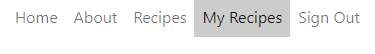
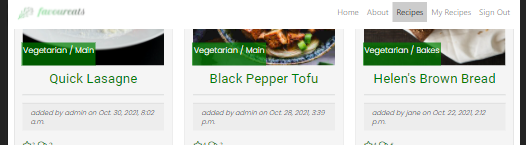
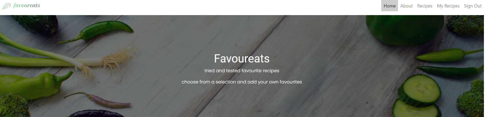
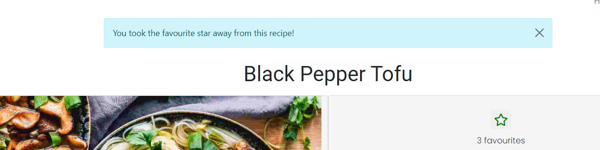
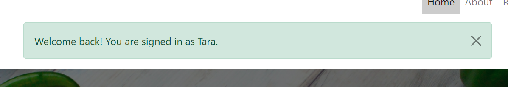

# Automated Testing
## Set-up for testing in local environment
## Unittest
Unittest was used to test the correct template was rendered
# Manual Testing
## Testing User Stories
#### Epic: Set up admin page for admin to manage recipe posts, reviews and site users
To test the admin user stories begin with the following steps:
1. Navigate to the website of [favoureats](https://favoureats.herokuapp.com/)
2. Click on the 'Sign In' tab on the navigation menu bar
3. Sign in with admin's name and password
4. Navigate to [admin page](https://favoureats.herokuapp.com/admin/)

#### User Stories:
  * As a site admin I can create draft recipe posts so that I can complete the recipes later (must-have / complete)(#8)

  Description: The site administrator is able to create draft recipes.

  Testing Steps:
  
1. In the admin panel menu beside recipes click the add button
2. In the recipe form enter content in the fields
3. Click save to save the created recipe
 

  
  
  

  

  Expected result: A draft recipe is saved by default to the list of recipes in the admin panel
  Actual result: A draft recipe is saved to the list of recipes in the admin panel
  Pass/Fail: Pass

  * As a Site Admin I can CRUD recipes so that I can manage my site content (must-have / complete)(#9)
  Description: The site administrator is able to create, read, update and delete recipes.

  Testing Steps:
  To create a recipe:
  
  1. In the admin panel menu beside recipes click the add button
  2. In the recipe form enter content in the fields
  3. Change the status to published from the status dropdown menu
  4. Click save to save the created recipe

Expected result: The recipe is saved as 'published' to the list of recipes in the admin panel. The recipe is viewable on the website
Actual result: The recipe is saved as 'published' to the list of recipes in the admin panel. The recipe is viewable on the website
Pass/Fail: Pass

To read/update a recipe:

1. In the admin panel list select a recipe title to read the full recipe
2. To update the recipe update the necessary fields and click save

Expected result: The viewed/updated recipe is saved to the list of recipes
Actual result: The viewed/updated recipe is saved to the list of recipes
Pass/Fail: Pass

To delete a recipe:
1. From the list of recipes in the admin panel select the recipe to be deleted in the checkbox beside the title
2. In the action dropdown menu above the list select 'delete' and 'go' to delete the recipe

Expected result: The viewed/updated recipe is deleted from the list of recipes and is not visible on the website
Actual result: The viewed/updated recipe is deleted from the list of recipes and is not visible on the website
Pass/Fail: Pass
  
  
   
  
    
  

* As a site admin I can approve reviews so that I can filter out inappropriate content (must-have / complete)(#10)

Testing Steps:

1. In the admin panel select reviews to view a list of draft and published reviews
2. In the list select a review in the checkbox
3. In the action dropdown menu above the list select 'approve selected review' or 'delete selected review' and then 'go'

Expected result 1: The approved review is published on the website
Expected result 2: The deleted review is removed from the list of reviews
Actual result 1: The approved review is published on the website
Actual result 1: The deleted review is removed from the list of reviews
Pass/Fail: Pass

* As an admin I can view the number of favourites on a recipe post so that I can know which are the most popular(#28)

1. In the admin panel select a recipe
2. Scroll down to the favourites field to view highlighted names of users who have favourited the recipe
3. On the website navigate to the recipe list page where the number of favourites is shown under the recipeawarded to a recipe 
4. On the website click on a recipe to open the full detail to see the number of favourites beside the recipe

Expected result 1: The names of users who have favourited a recipe are highlighted in the admin panel recipe view
Expected result 2: The number of favourites appears beside the star on the recipes page
Expected result 3: The number of favourites appears beside the star on the recipe detail page

Actual result 1: The names of users who have favourited a recipe are highlighted in the admin panel recipe view
Actual result 2: The number of favourites appears beside the star on the recipes page
Actual result 3: The number of favourites appears beside the star on the recipe detail page

Pass/Fail: Pass

* As an admin I can view reviews of a recipe post so that I can read the commentary on a recipe(#29)
This is tested in #10 above with a PASS result.

* As an admin I can create reviews of recipe posts so that I can generate discussion on recipe posts(#31)

1. In the admin panel select the 'add' button beside 'Reviews'
2. In the content form select a recipe from the dropdown menu.
3. Complete the content fields and the checkbox 'approved' to publish or leave blank to create a draft
4. Click save

Expected result 1: The review appears in the list of reviews in the admin panel
Expected result 2: The approved review is published on the website

Actual result 1: The review appears in the list of reviews in the admin panel
Actual result 2: The approved review is published on the website
Pass/Fail: Pass

#### Epic: Enable users to register on the site to access full features
#### User Stories:
  * As a user I can register an account so that I can access the full range of features on the site (must-have / complete)(#18)

Testing Steps:
1. Navigate to the website of [favoureats](https://favoureats.herokuapp.com/)
2. Click on the 'Register' tab on the navigation menu bar
3. Create an account with username, email and password

Expected result 1: Message displays 'You have successfully signed in'
Expected result 2: Sign In link in navigation changes to Sign Out

Actual result 1: Message displays 'You have successfully signed in'
Actual result 2: Sign In link in navigation changes to Sign Out

Pass/Fail: Pass

  * As a registered user I can login and logout of the site so that I can access my content (must-have / complete)(#19)

Testing Steps:
1. Navigate to the website of [favoureats](https://favoureats.herokuapp.com/)
2. Click on the 'Sign In' link in the navigation menu and sign in with username and password
3. Click on the 'Sign Out' link to sign out.

Expected result 1: Message displays 'You have successfully signed in'
Expected result 2: Message displays 'You have successfully signed out'
Expected result 3: Sign In link in navigation changes to Sign Out and vice versa

Actual result 1: Message displays 'You have successfully signed in'
Actual result 2: Message displays 'You have successfully signed out'
Actual result 3: Sign In link in navigation changes to Sign Out and vice versa

Pass/Fail: Pass

#### Epic: Create landing page to attract users to the site
#### User Stories:
  * As a user I can view a snapshot of the site on the landing page so that know what the site's purpose is (must-have/complete)(#24)

Testing Steps:
1. Navigate to the website of [favoureats](https://favoureats.herokuapp.com/)
2. Scroll down the page to view the text in the hero image
3. Scroll down to view most recent recipes posted
4. Scroll down to see button to 'view recipes'

Expected result 1: Text visible on hero image explaining site
Expected result 2: Call to action 'Register' button on hero image
Expected result 3: Text indicating users must sign in to view full recipes and create recipes
Expected result 4: Three most recent images displaying
Expected result 5: Call to action 'View recipes' button on below three latest images directing users to recipes list page

Actual result 1: Text visible on hero image explaining site
Actual result 2: Call to action 'Register' button on hero image
Actual result 3: Text indicating users must sign in to view full recipes and create recipes
Actual result 4: Three most recent images displaying
Actual result 5: Call to action 'View recipes' button on below three latest images directing users to recipes list page

Pass/Fail: Pass

#### Epic: Enable registered users to CRUD their own recipes
#### User Stories:
  * As a registered user I can CRUD my own recipes so that I can manage my own content (should-have / complete)(#12)

Testing Steps:
1. Navigate to the website of [favoureats](https://favoureats.herokuapp.com/)
2. Click on the 'Sign In' link in the navigation menu and sign in with username and password
3. Navigate to the page of [favoureats](https://favoureats.herokuapp.com/myrecipes) to view a list of the logged in users recipes
4. Click on view beside a recipe in the list to view the full recipe detail page
5. Click on edit beside a recipe in the list to view the recipe form, edit the content and click on 'Submit Recipe' to save changes
6. Click on delete beside a recipe in the list to delete a recipe. 

Expected result 1: Full recipe detail page opens when view is clicked
Expected result 2: Recipe is updated on website when edits are submitted.
Expected result 3: Success message displays when updated recipe is submitted.
Expected result 4: Confirm delete page displays when user clicks on delete
Expected result 5: Success message displays when user successfully deletes recipe.

Actual result 1: Full recipe detail page opens when view is clicked
Actual result 2: Recipe is updated on website when edits are submitted.
Actual result 3: Success message displays when updated recipe is submitted.
Actual result 4: Confirm delete page displays when user clicks on delete
Actual result 5: Success message displays when user successfully deletes recipe.

Pass/Fail: Pass

#### Epic: Create recipe list page to showcase content to users
#### User Stories:
  * As a user I can view a list of recipes so that I can see what I would like to select if registered (must-have / complete)(#15)

Testing Steps:
1. Navigate to the website of [favoureats](https://favoureats.herokuapp.com/)
2. Click on the 'recipes' link in the navigation menu or the 'view recipes' button at the bottom of the page
3. Scroll down to view a summary list of recipes posted

Expected result 1: User is redirected to Recipes page

Actual result 1: User is redirected to Recipes page

Pass/Fail: Pass

#### Epic: Enable registered users to search through the recipes to enhance UX
#### User Stories:
  * As a user I can search my own recipe posts by title and ingredient so that easily find a recipe (should-have / complete)(#23)

Testing Steps:
1. Navigate to the website of [favoureats](https://favoureats.herokuapp.com/)
2. Login to the website
3. Click on the 'myrecipes' link in the navigation menu
4. Enter text in the search box and click the search icon
5. Click the 'x' to clear the search and return to full list of recipes

Expected result: List of recipes corresponding to search query is displayed or 'no recipes found' if there is no match

Actual result: List of recipes corresponding to search query is displayed or 'no recipes found' if there is no match

Pass/Fail: Pass

  * As a user I can search through the recipe list page by title and ingredient so that I can easily find a recipe (should-have / complete) (25)

Testing Steps:
1. Navigate to the website of [favoureats](https://favoureats.herokuapp.com/)
2. Click on the 'recipes' link in the navigation menu
3. Enter text in the search box and click the search icon
4. Click the 'x' to clear the search and return to full list of recipes

Expected result: List of recipes corresponding to search query is displayed or 'no recipes found' if there is no match

Actual result: List of recipes corresponding to search query is displayed or 'no recipes found' if there is no match

Pass/Fail: Pass

#### Epic: Enable registered users to interact with recipe posts to enhance UX
#### User Stories:
  * As a registered user I can click on a post in the recipe list so that I open the full recipe post (must-have / complete)(#20)

Testing Steps:
1. Navigate to the website of [favoureats](https://favoureats.herokuapp.com/)
2. Login to the website
3. Click on the 'recipes' link in the navigation menu
4. Click on the title of a recipe
5. Repeat test for user not logged in

Expected result: User is redirected to full recipe detail page. User not logged in is directed to 'sign in' page.

Actual result: User is redirected to full recipe detail page. User not logged in is directed to 'sign in' page.

Pass/Fail: Pass

* As a registered user I can favorite/unfavorite recipes so that I can interact with the site content (must-have / complete)(#11)

Testing Steps:
1. Navigate to the website of [favoureats](https://favoureats.herokuapp.com/)
2. Login to the website
3. Click on the 'recipes' link in the navigation menu
4. Click on the title of a recipe
5. Click on the star icon to toggle 'favourite' on and off

Expected result 1: When user clicks on star, star becomes full colour to favourite and outline only if not favourite.
Expected result 2: Number beside favourites star is updated

Actual result 1: When user clicks on star, star becomes full colour to favourite and outline only if not favourite.
Actual result 2: Number beside favourites star is updated

Pass/Fail: Pass

  * As a logged-in user I can review a recipe so that I can interact with the site (must-have / complete)(#32)

Testing Steps:
1. Navigate to the website of [favoureats](https://favoureats.herokuapp.com/)
2. Login to the website
3. Click on the 'recipes' link in the navigation menu
4. Click on the title of a recipe to open the full recipe detail page with review form
5. Enter content in the review box and click 'submit'

Expected result: Thankyou message displays thanking user for submitting a review. 'Your review is pending approval'. Review appears as draft in admin panel list of reviews.

Actual result: Thankyou message displays thanking user for submitting a review. 'Your review is pending approval'. Review appears as draft in admin panel list of reviews.

Pass/Fail: Pass

## Testing Features

### Navigation
- check that all navigation links work as expected

Testing Steps:
1. Navigate to [favoureats](https://favoureats.herokuapp.com/)
2. Without logging in click on the links in the navbar
3. Login and click the links in the navbar
4. Scroll down the page

Expected Results
1. Not logged in user can view links to Home, About, Recipes, Register and Sign In
2. Each of these links opens the expected page
3. Logged in user can view links to Home, About, Recipes, My Recipes and Sign Out
4. Each of these links opens the expected page
5. Active page is highlighted in each case
6. Navbar remains in view when scrolling

Actual Result
1. Not logged in user can view links to Home, About, Recipes, Register and Sign In
2. Each of these links opens the expected page
3. Logged in user can view links to Home, About, Recipes, My Recipes and Sign Out
4. Each of these links opens the expected page
5. Active page is highlighted in each case
6. Navbar remains in view when scrolling

  

Pass/Fail: Pass

### Logo

- check that logo links back to the home page:

Testing Steps:
1. Open each page and click on logo

Expected Result
- logo links back to home page from each page

Actual result
- logo links back to home page from each page

Pass/Fail: Pass

### Footer
- check that social media links direct the user to the correct website of Facebook, Instagram and Twitter pages

Testing Steps

1. Click on each icon

Expected result
1. Each icon opens on a separate tab to its corresponding social media website

Actual Result
1. Each icon opens on a separate tab to its corresponding social media website

Pass/Fail: Pass

### Home Page
### Register Button

* Check that hero register button on hero image is not visible when user is signed in and that the register link navigates to the sign up page

Testing Steps
1. Navigate to [favoureats](https://favoureats.herokuapp.com/)
2. Without logging in look at the hero image
3. Click on the register button
4. Login and view the hero image

Expected Results
1. Register button is visible to not logged in users
2. Register button is not visible when user is loged in
3. Register button links to sign up page

Actual Results
1. Register button is visible to not logged in users
2. Register button is not visible when user is loged in
3. Register button links to sign up page

Pass/Fail: Pass

*View to not signed in user*

*View to signed in user*

### Recipes/My Recipes text links
* Check that links in Latest Recipes text direct users to correct page. Recipes page link goes to Recipes page and My Recipes link takes not logged in users to Sign In page and logged in users to My Recipes page

Testing Steps
1. Click on links without logging in
2. Click on links after logging in

Expected results
1. Both users ar directed to Recipes Page
2. Only logged in user can open My Recipes page while not logged in user is directed to Sign In page

Acctual results
1. Both users ar directed to Recipes Page
2. Only logged in user can open My Recipes page while not logged in user is directed to Sign In page

Pass/Fail: Pass

*Latest recipe information*

### Snapshot images
- check that images are of three most recent recipe posts with title, date added and author. 

Testing Steps
1. Log in to admin panel
2. Check list of recipes
3. Check that the three images correspond to the most recent recipe additions

Expected Result:
1. The three recipes are the most recent additions and the most recent is first

Actual Result:
1. The three recipes are the most recent additions and the most recent is first

Pass/Fail: Pass

*Three latest recipes*

### View the Recipes button
* Check that the 'View the Recipes' button links to Recipes page

Testing Steps
1. Click on the View the Recipes button

Expected Result
1. When button is clicked the user is redirected to the Recipes page

Pass/Fail: Pass

*View the Recipes button*

#### About Page

* Check that 'View the Recipes' button redirects users the Recipes page

Testing Steps
1. Click on the View the Recipes button

Expected Result
1. When button is clicked the user is redirected to the Recipes page

Pass/Fail: Pass

#### Recipes Page
#### Image Link
* Check that images with summary description of all the recipes are visible on the page and that title link redirects logged in users to full recipe detail page. Logged in users are redirected to the Sign In page. 

Testing Steps
1. Make sure to be signed out and click on recipe title link in selected recipe
2. Sign in and repeat step 1

Expected Results
1. Not logged in user is redirected to Sign In page
2. Logged in user is redirected to full recipe detail page

Actual Results
1. Not logged in user is redirected to Sign In page
2. Logged in user is redirected to full recipe detail page

Pass/Fail: Pass

*Recipes Page*
#### Search Bar

* Check that search bar locates a recipe when a keyword is entered into the box. Check that the search icons startes the search and that the full recipe list page is returned after the 'x' is clicked. 

Testing Steps
1. Enter a word in the search box.
2. Click the search icon
3. Click the 'x'

Expected Results
1. The search icon starts the search function
2. The search result displays one or more recipes.
2. 'No recipes to view' is displayed if none are found
3. The 'x' when clicked returns the full list of recipes

Actual Results
1. The search icon starts the search function
2. The search result displays one or more recipes.
2. 'No recipes to view' is displayed if none are found
3. The 'x' when clicked returns the full list of recipes

Pass/Fail: Pass

*Search results for flour*

### Back to Top Arrow
- check that back to top arrow remains on screen once user has started scrolling

Testing Steps
1. Start scrolling on the Recipes page

Expected Result
1. Back to Top arrow appears
2. Arrow remains on screen as user scrolls

Actual Result
1. Back to Top arrow appears
2. Arrow remains on screen as user scrolls

Pass/Fail: Pass

*Back to top arrow*

#### Recipe Detail Page
#### Star Icon
* Check the star icon which can be clicked to favourite/unfavourite a recipe:
* Check the number of favourite stars given to the recipe updates when the star is clicked and unclicked
* Check that confirmation of the favourite/unfavourite actions are displayed

Testing Steps
1. Click on the star
2. Click again on the star

Expected results
1. When the star is clicked if the recipe is not currently a favourite of the user the star is an outline and will change to full (green) colour star and the number underneath increases by one
2. When the star is clicked if the recipe is currently a favourite of the user the star is a full green colour and will change to outline only. The number underneath decreases by one

Actual results
1. When the star is clicked if the recipe is not currently a favourite of the user the star is an outline and will change to full (green) colour star and the number underneath increases by one
2. When the star is clicked if the recipe is currently a favourite of the user the star is a full green colour and will change to outline only. The number underneath decreases by one

Pass/Fail: Pass

*Star icon when user has favourited the recipe with success message*

*Star Icon when user has not favourited with message and total updated*

#### Review Form
- Check that the form submits when a user completes the body field and clicks submit
- Check that a success message appears and disappears shortly after
- Check that 'Your review is pending approval' is shown until the admin approves the review for publication:

Testing Steps
1. Enter text into the body of the review
2. Click submit
3. Log into the admin panel
4. Check the box beside the review just added and select approve in th dropdown menu
5. Navigate back to the same recipe

Expected results
1. Review is submitted and can be viewed in the admin panel
2. Message of success appears on submission and disappears automatically
3. WHen review is approved it appears in the review section of the recipe

Actual results
1. Review is submitted and can be viewed in the admin panel
2. Message of success appears on submission and disappears automatically
3. WHen review is approved it appears in the review section of the recipe

*Pending approval below published reviews*

*Review thanks message*

*Reviews published*

### 'Add a Recipe' button 
- check that the Add a Recipe button redirects logged in users to the My Recipes page and non-logged in users to the sign in page.

Testing Steps
1. As a not logged in user click on the button
2. Repeat after logging in

Expected Results
1. Not logged in user is redirected to Sign In page
2. Logged in user is redirected to the My Recipes page

Actual Results
1. Not logged in user is redirected to Sign In page
2. Logged in user is redirected to the My Recipes page

Pass/Fail: Pass

*Add a Recipe Button*

#### My Recipes Page
####

#### Search Bar

* Check that search bar locates a recipe when a keyword is entered into the box. Check that the search icons startes the search and that the full recipe list page is returned after the 'x' is clicked. 

Testing Steps
1. Enter a word in the search box.
2. Click the search icon
3. Click the 'x'

Expected Results
1. The search icon starts the search function
2. The search result displays one or more recipes.
2. 'No recipes to view' is displayed if none are found
3. The 'x' when clicked returns the full list of recipes

Actual Results
1. The search icon starts the search function
2. The search result displays one or more recipes.
2. 'No recipes to view' is displayed if none are found
3. The 'x' when clicked returns the full list of recipes

Pass/Fail: Pass

*Search bar*

#### 'Add a Recipe' button. 
- check that when a user clicks on this button the recipe form opens where the user can enter all the fields of the recipe:

Testing Steps
1. Click on the Add a Recipe button

Expected Result
1. Recipe form opens

Actual Result
1. Recipe form opens

Pass/Fail: Pass

*Add a Recipe Button*

*Add a Recipe Form*

#### Recipe list table with CRUD features 
- Check that the the view, edit and delete links open the corresonding pages and that the list of recipes corresponds to recipes added by the current user. 
- Check that the success and warning messages appear for each function
- Check that the recipe is updated and deleted as appropriate for each function

Testing Steps
1. In the My Recipes list click on the view link for a recipe
2. Check in the recipe detail that the recipe was added by the current user
3. In the My Recipes list click on the edit link
4. Change some of the content
5. Submit the changed recipe
6. In the My Recipes list click view to view the changed recipe
7. In the My Recipes list click the delete button for a recipe
8. In the warning message select Go Back
9. Select delete again
7. In the warning message click confirm delete

Expected results
1. When view is clicked the full recipe detail page opens
2. The user who added the recipe corresponds with the current user
3. When edit is clicked the completed recipe form opens
4. When changes are made and submitted a success message is displayed that the user has updated the recipe
5. The recipe detail view reflects the changes made
6. When delete is clicked a warning appears asking the user to confirm delete
7. When delete is clicked in the warning message the recipe is removed from the list
8. A message appears to the user confirming that the recipe has been deleted
9. If the user selects Go Back in the warning message, the user is redirected to the My Recipes page

Actual results
1. When view is clicked the full recipe detail page opens
2. The user who added the recipe corresponds with the current user
3. When edit is clicked the completed recipe form opens
4. When changes are made and submitted a success message is displayed
5. The recipe detail view reflects the changes made
6. When delete is clicked a warning appears asking the user to confirm delete
7. When delete is clicked in the warning message the recipe is removed from the list
8. A message appears to the user confirming that the recipe has been deleted
9. If the user selects Go Back in the warning message, the user is redirected to the My Recipes page

Pass/Fail: Pass

*Recipes table*

*Recipe Edit Form*

*Successful update message*

*Delete recipe confirmation*

*Successful delete message*

#### Register Page

* Check that users can register for an account by entering a username, an optional email and a password
* Check that the button Sign Up registers the user
* Check that the Home button redirects to the home page

Testing Steps
1. Click Register
2. Click the Home button
3. Click on the Register button again
4. Enter a username and password without email
5. Click Sign Up
6. Navigate to admin panel to see user listed

Expected Results
1. Home button redirects to Home page
2. User receives error message if password does not conform to requrements of length, difference to username
3. User registers successfully and success message displays
4. User is listed as User in admin panel

Pass/Fail: Pass

*Register form*

*Successful registration message*

#### Sign-In Form
* Check that User signs in by entering username and password
* Check that Sign In button submits the form
* Check that Home button redirects to the home page

Testing Steps
1. Enter a username without password
2. Enter a username with password
3. Click Home
4. Repeat steps 1 and 2 and click sign in

Expected results
1. Error message displays if usere does not enter a username and password
2. User signs in successfully with username and password
3. Success message is displayed and disappears automatically
4. User is redirected to Home page if Home is clicked

Actual results
1. Error message displays if usere does not enter a username and password
2. User signs in successfully with username and password
3. Success message is displayed and disappears automatically
4. User is redirected to Home page if Home is clicked

Pass/Fail: Pass

*Sign In Form*

*Sign in success message*

#### Sign-Out Page

* Check that Sign Out button signs user out. 
* Check that Home button redirects user to Home page
* Check that user is redirected to home page after signing out:

Testing Steps
1. Click Sign Out in the navigation menu
2. Click Home button
3. Repeat step 1
2. Click Sign Out in the Sign Out page

Expected Results
1. Home button redirects user to Home page
2. Sign out button signs user out and message displays to tell user they have signed out
3. User is redirected to Home page aftere signing out

Actual Results
1. Home button redirects user to Home page
2. Sign out button signs user out and message displays to tell user they have signed out
3. User is redirected to Home page aftere signing out

Pass/Fail: Pass

*Sign out page*

#### Recipe Form page

* Check that user can submit a recipe to the database for display on the website and is then redirected to the My Recipes page

Testing Steps
1. Click Add a Recipe in the My Recipes page
2. Click Go Back button
3. Repeat step 1
4. Click Submit with blank fields
5. Complete all required fields (not image) and click Submit
6. Click Add a Recipe and complete all fields and upload an image.
7. Click Submit
8. Navigate to the Home, Recipes and My Recipes pages to check the recipes are displaying, one with placeholder image and one with user's own

Expected Results
* Go Back button at the top redirects users to the My Recipes page
* Messages appear to indicate if required fields have not been filled in before submission.
* User can enter text in fields
* Dropdown menus function correctly
* User cannot enter incorrect values or out of range values in fields
* User can upload an image in the image field.
* If no image is uploaded a placeholder image is used.
* When submit button is clicked the recipe is uploaded to the database and appears on the Home page, Recipes page and My Recipes page
* The user is redirected to My Recipes page after submitting a recipe

Actual Results
* Go Back button at the top redirects users to the My Recipes page
* Messages appear to indicate if required fields have not been filled in before submission.
* User can enter text in fields
* Dropdown menus function correctly
* User cannot enter incorrect values or out of range values in fields
* User can upload an image in the image field.
* If no image is uploaded a placeholder image is used.
* When submit button is clicked the recipe is uploaded to the database and appears on the Home page, Recipes page and My Recipes page
* The user is redirected to My Recipes page after submitting a recipe

Pass/Fail: Pass

*Recipe form*

* A Submit Recipe button at the bottom to submit the completed form

*Submit button*

#### 404 Page
* Check that the 404 page displays when the user enters a url which does not exist. 

Testing Steps
1. Navigate to [favoureats](https://favoureats.herokuapp.com/)
2. Type in an incorrect url

Expected result
1. 404 page displays

Actual result
1. 404 page displays

Pass/Fail: Pass

#### 500 Page
A 500 server error page was created to handle internal server errors

- The navbar collapses for mobile and portrait tablets:

*Navbar collapsed*

## Code Validation
## HTML Validation
HTML was validated by [The WEC Markup Validation Service](https://validator.w3.org/)
No errors or warnings were found:

[Home Page](https://validator.w3.org/nu/?doc=https://favoureats.herokuapp.com/)

[About Page](https://validator.w3.org/nu/?doc=https://favoureats.herokuapp.com/about/)

[Recipes Page](https://validator.w3.org/nu/?doc=https://favoureats.herokuapp.com/recipes/)

[My Recipes Page](https://validator.w3.org/nu/?doc=https://favoureats.herokuapp.com/myrecipes/)

[Register Page]()
https://validator.w3.org/nu/?doc=https://favoureats.herokuapp.com/accounts/signup/

[Login Page](https://validator.w3.org/nu/?doc=https://favoureats.herokuapp.com/accounts/login/)

[Logout Page](https://validator.w3.org/nu/?doc=https://favoureats.herokuapp.com/accounts/logout/)

## CSS Validation

## Browser compatibility
## Responsiveness

## Bugs here ????